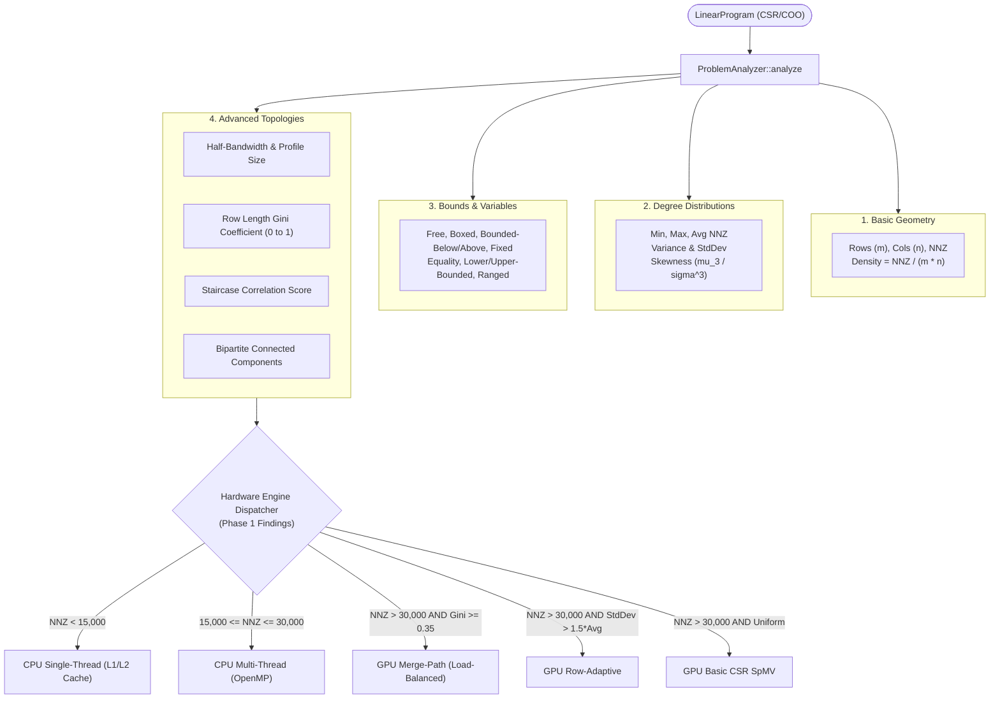

# PipePye Problem Characterization & Hardware Architecture Dispatcher

**Module**: `pipepye::analysis`  
**Status**: Implemented, Verified, Integrated into CMake & CTest (6 / 6 Analyzer Tests, 116 / 116 Total Tests Passing)  
**Authors**: PipePye Numerical Core Team  
**Date**: September 2026  

---

## 1. Motivation: Beyond a Single Density Number

In **Phase 1**, empirical benchmarking of SpMV on an NVIDIA RTX 3050 Ampere GPU demonstrated that:
1. GPU speedup is **not uniform**: on matrices with $\text{NNZ} < 15,000$, CPU execution in L1/L2 cache is **$3.8\times - 7.4\times$ faster** than GPU execution due to PCIe transfer and kernel launch overhead.
2. In irregular hub matrices (power-law row degrees), **standard CSR SpMV suffers catastrophic intra-warp branch divergence**, whereas **Merge-Path SpMV maintains balanced execution**.
3. In banded and block-diagonal structures, coalesced memory access patterns make **standard 1-thread-per-row CSR SpMV** optimal.

Therefore, the solver cannot treat all sparse matrices identically. PipePye introduces a comprehensive **Problem Characterization Layer** ([`ProblemStats`](file:///home/satyansh/pipepye/include/pipepye/analysis/problem_stats.hpp) and [`ProblemAnalyzer`](file:///home/satyansh/pipepye/include/pipepye/analysis/problem_analyzer.hpp)) that extracts structural, geometric, and topological metrics to automatically dispatch the optimal computational engine.

---

## 2. Structural & Topological Metrics

### 2.1 Row-Length Imbalance & Gini Coefficient
To detect whether a sparse matrix exhibits heavy-tailed degree distributions (such as hub nodes in network flows or power-grid matrices), we compute the **Gini coefficient** $G \in [0, 1]$ of the row degrees:
$$G = \frac{2 \sum_{k=1}^m k \cdot y_k}{m \sum_{k=1}^m y_k} - \frac{m + 1}{m}$$
where $y_1 \le y_2 \le \dots \le y_m$ are the sorted row degrees ($\text{row\_nnz}$).
- $G \approx 0$: Perfectly uniform row lengths (ideal for standard CSR SpMV).
- $G \ge 0.35$: Severe degree imbalance (hubs cause warp stalls in basic CSR, requiring Merge-Path SpMV).

### 2.2 Half-Bandwidth & Envelope Profile
Measures matrix diagonal clustering:
$$\text{half\_bandwidth} = \max_{(i, j): A_{i,j} \ne 0} |i - j|, \qquad \text{profile\_size} = \sum_{i=1}^m \left(i - \min_{j: A_{i,j} \ne 0} j\right)$$

### 2.3 Staircase Progression Score
Multi-period dynamic LPs exhibit staircase coupling where stage $t$ interacts with stage $t+1$. We compute the Pearson correlation $r \in [-1, 1]$ between the row index $i$ and the median column index $M_i$:
$$r = \frac{\sum (i - \bar{i})(M_i - \bar{M})}{\sqrt{\sum (i - \bar{i})^2 \sum (M_i - \bar{M})^2}}$$
A score $r > 0.80$ indicates strong staircase temporal progression.

### 2.4 Bipartite Connected Components
Builds a bipartite graph with $m$ row vertices and $n$ column vertices connected by nonzeros $A_{i,j} \ne 0$. Using Disjoint Set Union (DSU), computes the number of independent connected components $\implies$ reveals uncoupled block-diagonal subproblems that can be solved in parallel.

---

## 3. Hardware Engine Dispatcher Rules

Based on the 319 Phase 1 empirical benchmarks, [`ProblemAnalyzer`](file:///home/satyansh/pipepye/src/analysis/problem_analyzer.cpp#L236-L270) applies deterministic dispatching:

| Condition | Recommended Engine | Architectural Rationale |
| :--- | :--- | :--- |
| $\text{NNZ} < 15,000$ | `RecommendedEngine::CPU_SingleThread` | Fits within 320 KiB L1 / 7 MiB L2 cache; CPU runtime is $1.6 - 6.0\ \mu\text{s}$, whereas GPU kernel launch overhead alone is $\approx 15 - 25\ \mu\text{s}$. |
| $15,000 \le \text{NNZ} \le 30,000$ | `RecommendedEngine::CPU_MultiThread` | Crossover zone; OpenMP 4–12 threads scales without PCIe host-device latency. |
| $\text{NNZ} > 30,000$ and ($G \ge 0.35$ or $\text{Imbalance} \ge 4.0\times$) | `RecommendedEngine::GPU_MergePath` | Extreme degree variance causes warp serialization; Merge-Path partitions nonzeros evenly across all 2560 GPU CUDA cores. |
| $\text{NNZ} > 30,000$ and $\sigma_{\text{row}} > 1.5 \times \mu_{\text{row}}$ | `RecommendedEngine::GPU_RowAdaptive` | Dynamic warp allocation prevents load imbalance across Streaming Multiprocessors. |
| $\text{NNZ} > 30,000$ and $G < 0.35$ | `RecommendedEngine::GPU_CSR_Basic` | Uniform row lengths enable maximum memory coalescing and peak GDDR6 bandwidth ($145\ \text{GB/s}$). |

---

## 4. Verification & Empirical Results

Verified via automated tests in [`tests/test_problem_analyzer.cpp`](file:///home/satyansh/pipepye/tests/test_problem_analyzer.cpp):

| Test Name | Topology / Problem | Key Validated Metric | Dispatcher Recommendation |
| :--- | :--- | :--- | :--- |
| `UniformRandomMatrixProperties` | $100 \times 100$ Random, density $0.05$ | $G < 0.30$, Imbalance $< 3.0\times$ | `CPU_SingleThread` (NNZ < 15k) |
| `BandedMatrixBandwidth` | $100 \times 100$ Banded, bandwidth $k=5$ | $\text{half\_bandwidth} \le 5$ | `CPU_SingleThread` |
| `BlockDiagonalConnectedComponents` | 4 blocks of $25 \times 25$ | $\text{components} \ge 4$ | `CPU_SingleThread` |
| `StaircaseMatrixProgressionScore` | 10 dynamic stages of $10 \times 10$ | $\text{staircase\_score} > 0.85$ | `CPU_SingleThread` |
| `IrregularHubMatrixImbalance` | $2000 \times 2000$, $\text{NNZ} = 40,000$, $5\%$ hubs | $G \ge 0.35$, Imbalance $> 4.0\times$ | **`GPU_MergePath`** |
| `NetlibAFIROStructuralAnalysis` | Netlib AFIRO MPS ($27 \times 32$, 83 NNZ) | 32 bounded below, 83 NNZ | **`CPU_SingleThread`** |
