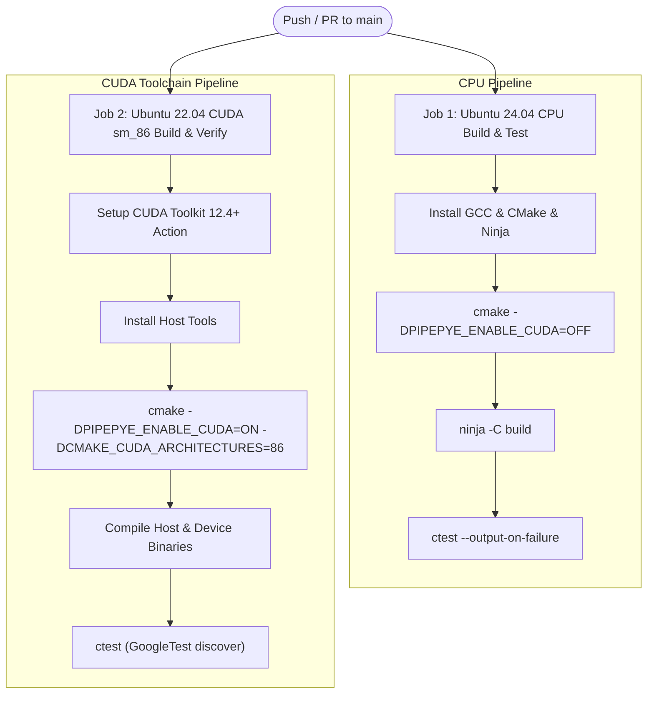

# Continuous Integration (CI) Pipeline

PipePye uses GitHub Actions to enforce strict build health, test correctness, and compilation across all commits and pull requests.

---

## 1. Workflow Architecture

The workflow configuration is defined in [`.github/workflows/ci.yml`](file:///.github/workflows/ci.yml).

The pipeline executes two parallel jobs on every `push` and `pull_request` targeting `main`:

---

## 2. Job Matrix Details

### Job 1: `build-and-test-cpu`
- **Environment**: Ubuntu 24.04 LTS runner
- **Compiler**: GCC (C++20 mode)
- **Flag**: `-DPIPEPYE_ENABLE_CUDA=OFF`
- **Purpose**: Validates that all mathematical structures, algorithms, and verification tools compile and test cleanly in headless environments without GPU dependencies.
- **Tests**: Runs `test_core` suite covering scalar precision, versioning, status codes, and timers.

### Job 2: `build-and-test-cuda`
- **Environment**: Ubuntu 22.04 LTS runner with CUDA Toolkit (`Jimver/cuda-toolkit`)
- **Target Architecture**: `-DCMAKE_CUDA_ARCHITECTURES=86` (NVIDIA Ampere sm_86)
- **Flag**: `-DPIPEPYE_ENABLE_CUDA=ON`
- **Purpose**: Verifies full compilation of `.cu` source files, CUDA headers (`<pipepye/cuda/cuda_check.cuh>`, `<pipepye/cuda/device_info.cuh>`), and kernel templates under `nvcc`.
- **Tests**: Executes `test_core` and `test_cuda`. In standard cloud runners without physical GPUs, `test_cuda` executes the CUDA error handling test and gracefully skips hardware-dependent kernel tests using GoogleTest's `GTEST_SKIP()`.

---

## 3. Adding New Tests

1. Create test file in `tests/test_<subsystem>.cpp` or `.cu`.
2. Add target to `tests/CMakeLists.txt` using `gtest_discover_tests(...)`.
3. Push to branch; CI will automatically build, link, and report results through `ctest`.
