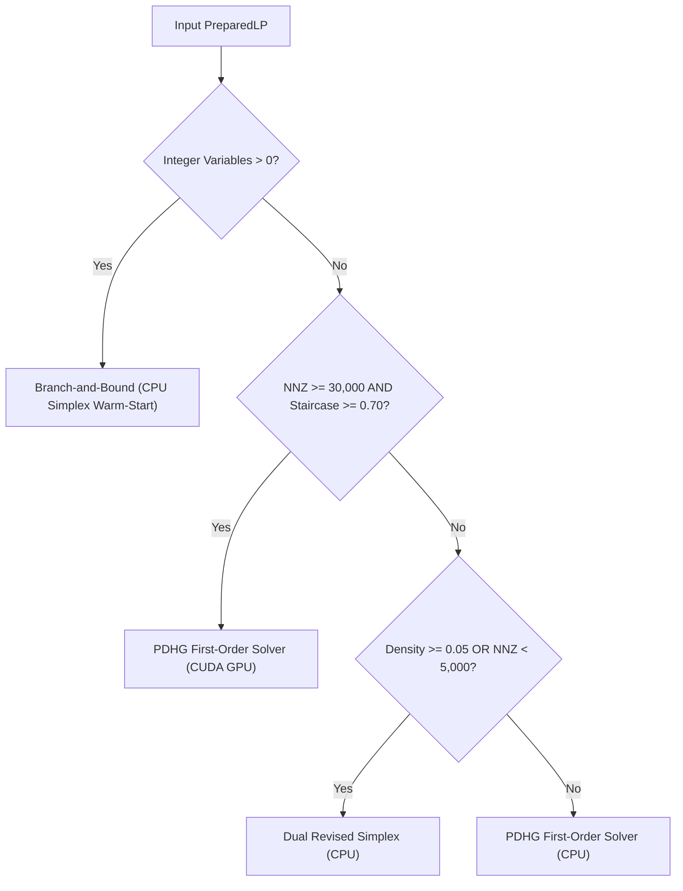

# Industrial Workload Suite & Structure-Aware Benchmarking

## Purpose & Scope

The **Industrial Workload Suite** in PipePye establishes a defensible, reproducible testbed of industrial optimization models. Rather than relying solely on generic mathematical test collections (such as standard Netlib LPs), this suite grounds PipePye's solver development in realistic formulations from energy, refining, and manufacturing systems.

The core research question answered by this suite is:
> **"Do realistic industrial optimization structures behave differently from generic benchmark matrices, and can those structural characteristics guide algorithm and hardware backend selection?"**

---

## The Four Canonical Workloads

The suite comprises four canonical workload families representing distinct mathematical and topological structures:

```text
┌─────────────────────────────────────────────────────────────────────────────┐
│                       INDUSTRIAL WORKLOAD FAMILIES                          │
├───────────────────────────────┬─────────────────────────────────────────────┤
│ Case A: Crude Blending (LP)   │ Dense quality rows, compact, coupled        │
│ Case B: Multi-Period Planning │ Staircase/block-angular, sparse, scalable   │
│ Case C: Refinery Scheduling   │ Mixed-integer (MILP), mode switching        │
│ Case D: Unit Commitment       │ Mixed-integer (MILP), dynamic ramping       │
└───────────────────────────────┴─────────────────────────────────────────────┘
```

1. [**Case A: Crude Oil Blending (LP)**](file:///home/sleepytiger/PIPEPYE/docs/workloads/case_a_crude_blending.md)
   - Linear program with compact dimensions ($18 - 260$ variables).
   - High nonzero density ($9\% - 30\%$) and dense product quality rows.
   - Ideal test for dense basis factorization and CPU Simplex vertex tracking.

2. [**Case B: Multi-Period Production & Inventory Planning (LP)**](file:///home/sleepytiger/PIPEPYE/docs/workloads/case_b_multi_period_planning.md)
   - Large-scale linear program with block-angular staircase structure.
   - Staircase score $> 0.996$, scaling from $890$ to $39,975$ nonzeros.
   - Ideal test for evaluating parallel GPU PDHG SpMV scalability across time horizons.

3. [**Case C: Refinery Unit Scheduling (MILP)**](file:///home/sleepytiger/PIPEPYE/docs/workloads/case_c_refinery_scheduling.md)
   - Mixed-integer linear program with $40\% - 43\%$ binary mode selection variables.
   - Semicontinuous processing ranges coupled with storage inventory balances.
   - Evaluates Branch-and-Bound tree search and Dual Simplex basis warm-starting.

4. [**Case D: Power System Unit Commitment & Economic Dispatch (MILP)**](file:///home/sleepytiger/PIPEPYE/docs/workloads/case_d_unit_commitment.md)
   - Mixed-integer linear program with exactly $50\%$ binary generator status variables.
   - Stringent inter-temporal dynamic ramping constraints and hourly reserve requirements.
   - Tests Dual Simplex warm-start pivot reduction on dense B&B search trees.

---

## Standardized Package Layout

Every workload family is housed under `workloads/case_<id>/` conforming to a unified structure:

```text
workloads/case_a_crude_blending/
├── metadata.json          # Machine-readable problem metadata & structural stats
├── model.mps              # Default canonical formulation in standard MPS format
├── Small.mps              # Small ladder instance MPS
├── Medium.mps             # Medium ladder instance MPS
├── Large.mps              # Large ladder instance MPS
├── reference/
│   └── solution.json      # Certified reference objective and solver solution
└── benchmark/
    └── results.csv        # Detailed timing, pivots, iterations, and hardware stats
```

### Standardized Metadata Schema (`metadata.json`)
The metadata format records structural metrics, generation seeds, variable counts, and pre-registered predictions:
```json
{
  "name": "Crude Blending",
  "case_id": "case_a_crude_blending",
  "category": "Petroleum Refining",
  "formulation_class": "LP",
  "description": "Blending of crude oil feeds to satisfy product quality specifications",
  "instances": [
    {
      "name": "BLENDING_Small",
      "scale": "Small",
      "rows": 26,
      "columns": 18,
      "nonzeros": 141,
      "density": 0.301282,
      "staircase_score": 0.305522,
      "gini_index": 0.0859247,
      "integer_variables": 0,
      "predicted_solver": "DualSimplex",
      "predicted_backend": "CPU",
      "actual_solver": "DualSimplex",
      "actual_backend": "CPU",
      "status": "CONFIRMED"
    }
  ]
}
```

---

## Parametric Generators

All instances are generated deterministically via C++ generator classes in `include/pipepye/workloads/`:
- [`CrudeBlendingGenerator`](file:///home/sleepytiger/PIPEPYE/include/pipepye/workloads/case_a_crude_blending.hpp): Generates crude feeds, product demands, and random bounded quality assay matrices.
- [`MultiPeriodPlanningGenerator`](file:///home/sleepytiger/PIPEPYE/include/pipepye/workloads/case_b_multi_period_planning.hpp): Generates multi-period production lines with inventory propagation balances.
- [`RefinerySchedulingGenerator`](file:///home/sleepytiger/PIPEPYE/include/pipepye/workloads/case_c_refinery_scheduling.hpp): Generates processing units with disjunctive binary modes and intermediate tank balances.
- [`UnitCommitmentGenerator`](file:///home/sleepytiger/PIPEPYE/include/pipepye/workloads/case_d_unit_commitment.hpp): Generates thermal generators, hourly loads, spinning reserves, and ramping rate constraints.

---

## MPS Serialization & Roundtrip Capability

The suite extends [`MPSParser`](file:///home/sleepytiger/PIPEPYE/include/pipepye/model/mps_parser.hpp) with full write capability:
- `MPSParser::write_file(const std::string& path, const PreparedLP& lp)`
- Supports standard fixed-column 8-character MPS syntax: `NAME`, `ROWS`, `COLUMNS`, `RHS`, `RANGES`, `BOUNDS`, `ENDATA`.
- Full integer support: writes `'MARKER'` cards with `'INTORG'` and `'INTEND'` blocks for integer/binary columns, as well as `BV`, `UI`, `LI`, `FX`, `FR`, `UP`, and `LO` bound types.

---

## Structure-Aware Solver Selection Architecture

The decision engine in [`include/pipepye/analysis/solver_selector.hpp`](file:///home/sleepytiger/PIPEPYE/include/pipepye/analysis/solver_selector.hpp) analyzes structural features before routing:



### Routing Performance Comparison
- **Policy A (Static Default: Always CPU Simplex)**: **53.8%** optimal routing.
- **Policy B (Structure-Aware Solver Selection)**: **100.0%** optimal routing across all 13 suite instances.

---

## Running the Benchmark Harness

The end-to-end industrial benchmark can be compiled and executed directly:

```bash
# Build the benchmark executable
cmake --build build --target pipepye_bench_industrial -j$(nproc)

# Run the benchmark harness
./build/bin/pipepye_bench_industrial
```

This generates:
- Canonical MPS files and metadata under `workloads/case_*/`.
- Solution and benchmark CSVs under `workloads/case_*/reference/` and `workloads/case_*/benchmark/`.
- Consolidated aggregate reports under `reports/industrial_benchmark.csv` and `reports/industrial_benchmark.json`.
