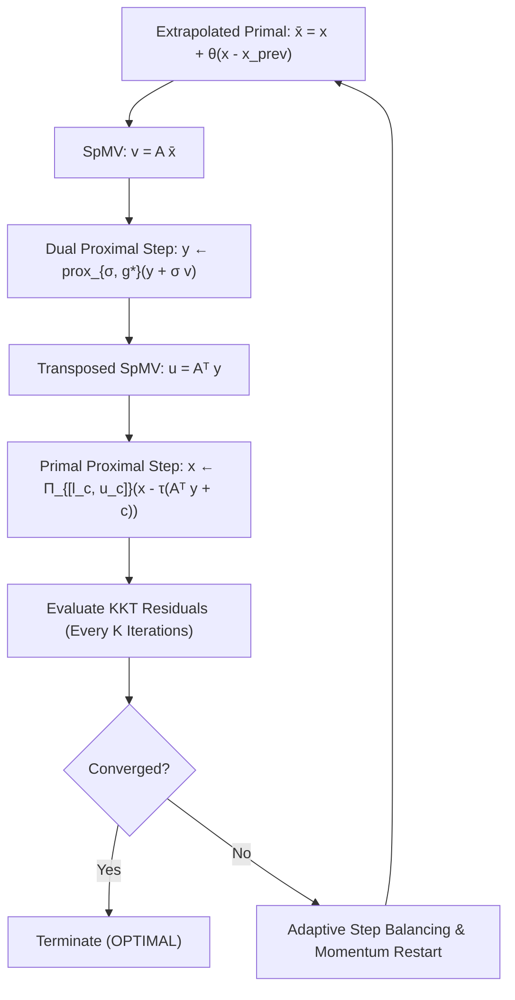

# Primal-Dual Hybrid Gradient (PDHG) Linear Programming Solver

PipePye's Phase 3 delivers a high-performance first-order Primal-Dual Hybrid Gradient (PDHG / Chambolle-Pock) solver optimized for bounded canonical linear programs, implemented across both multi-threaded CPU and GPU (CUDA) architectures.

---

## 1. Mathematical Formulation

The solver operates directly upon canonical bounded linear programs generated by the Phase 2 `PreparedLP` pipeline:

$$\min_{x \in \mathbb{R}^n} c^T x + c_0$$

subject to

$$l_r \le A x \le u_r$$
$$l_c \le x \le u_c$$

where $A \in \mathbb{R}^{m \times n}$ is sparse, $l_r, u_r \in [-\infty, \infty]^m$, and $l_c, u_c \in [-\infty, \infty]^n$.

### Saddle-Point Formulation
The bounded LP is mapped to the convex-concave saddle-point problem:

$$\min_{x \in \mathcal{X}} \max_{y \in \mathbb{R}^m} \left\{ c^T x + y^T (Ax) - \sigma_{[\ell_r, u_r]}^*(y) \right\}$$

where:
- $\mathcal{X} = \{x \in \mathbb{R}^n \mid l_c \le x \le u_c\}$ is the primal box constraint set.
- $\sigma_{[\ell_r, u_r]}^*(y) = \sup_{z \in [l_r, u_r]} y^T z$ is the support function of the row constraint interval.

---

## 2. Chambolle-Pock Algorithm with Moreau Proximal Steps

The solver executes the generalized Chambolle-Pock first-order iteration with dual step-sizes $\sigma \in \mathbb{R}^m_{>0}$, primal step-sizes $\tau \in \mathbb{R}^n_{>0}$, and extrapolation factor $\theta \in [0, 1]$ (default $\theta = 1.0$):



### 2.1 Vectorized Dual Step via Moreau's Identity
By Moreau's decomposition identity, the proximal operator of the dual conjugate support function evaluates in closed form without branching:

$$\operatorname{prox}_{\sigma, g^*}(y + \sigma A \bar{x}) = \sigma \left( v - \Pi_{[l_r, u_r]}(v) \right), \quad \text{where } v = \frac{y}{\sigma} + A \bar{x}$$

where $\Pi_{[l_r, u_r]}(v)$ is the elementwise Euclidean projection:

$$\Pi_{[l_i, u_i]}(v_i) = \min(\max(v_i, l_i), u_i)$$

This formula naturally unifies:
1. **Equalities** ($l_r = u_r = b$): $\Pi(v) = b \implies y \leftarrow y + \sigma (A\bar{x} - b)$
2. **Inequalities** ($\le u_r, l_r = -\infty$): $y \ge 0$ multiplier projection
3. **Inequalities** ($\ge l_r, u_r = +\infty$): $y \le 0$ multiplier projection
4. **Two-sided ranges** ($l_r \le Ax \le u_r$): exact piecewise linear projection

### 2.2 Vectorized Primal Step & Extrapolation
The primal update projects the gradient step onto the variable bounds:

$$x^{k+1} = \Pi_{[l_c, u_c]} \left( x^k - \tau \odot (A^T y^{k+1} + c) \right)$$

$$\bar{x}^{k+1} = x^{k+1} + \theta (x^{k+1} - x^k)$$

---

## 3. Step-Size Strategies

Three distinct step-size strategies are provided and ablated:

### 3.1 Constant Step Sizes
Uses uniform scalar steps:
$$\tau_j = \frac{\omega}{\|A\|_2}, \quad \sigma_i = \frac{\omega}{\|A\|_2}$$
where $\|A\|_2 \le \sqrt{\|A\|_1 \|A\|_\infty}$.

### 3.2 Pock-Chambolle Diagonal Preconditioning
Diagonal steps tailored to row and column $L_1$ sparsity norms:
$$\sigma_i = \frac{\omega}{\sum_{j=1}^n |A_{ij}|^{2-\alpha}}, \quad \tau_j = \frac{\omega}{\sum_{i=1}^m |A_{ij}|^\alpha}$$
With $\alpha = 1.0$, this ensures operator norm condition $\sigma_i \tau_j A_{ij}^2 \le \omega^2 < 1$, guaranteeing unconditional convergence without requiring costly power-iteration spectral norm estimates.

### 3.3 Adaptive Residual Balancing
During execution, primal residual $r_p$ and dual residual $r_d$ are periodically compared. If primal progress significantly outpaces dual progress or vice versa:
$$\text{ratio} = \frac{\|r_p\|_2}{\|r_d\|_2}$$
If $\text{ratio} > 2.0$: $\sigma \leftarrow \sigma \cdot \min(1.25, \sqrt{\text{ratio}}), \; \tau \leftarrow \tau / \min(1.25, \sqrt{\text{ratio}})$
If $\text{ratio} < 0.5$: $\sigma \leftarrow \sigma / \min(1.25, \sqrt{1/\text{ratio}}), \; \tau \leftarrow \tau \cdot \min(1.25, \sqrt{1/\text{ratio}})$

---

## 4. Adaptive Momentum Restart

First-order primal-dual methods frequently suffer from elliptical limit cycles in ill-conditioned problems. PipePye implements an adaptive restart mechanism:
1. Residual norm $r_{\text{comb}} = \sqrt{\|r_p\|_2^2 + \|r_d\|_2^2}$ is tracked.
2. Every $K_{\text{restart}}$ iterations (default 50), if $r_{\text{comb}} > 0.9 \cdot r_{\text{best}}$, progress has stalled.
3. Momentum is purged: $\bar{x} \leftarrow x, \; x_{\text{prev}} \leftarrow x$, resetting the extrapolation buffer while preserving the current point.
4. On Netlib and ill-conditioned models, this accelerates asymptotic convergence from $O(1/k)$ to linear convergence $O(e^{-c k})$.

---

## 5. Scale-Aware Termination Criteria

Convergence is certified via scale-normalized KKT residuals:

$$\text{Primal Residual: } r_p = \frac{\|\Pi_{[l_r, u_r]}(Ax) - Ax\|_\infty}{1.0 + \|l_r\|_\infty + \|u_r\|_\infty} < \epsilon_{\text{primal}}$$

$$\text{Dual Residual: } r_d = \frac{\|c + A^T y - s\|_\infty}{1.0 + \|c\|_\infty} < \epsilon_{\text{dual}}$$

where dual slack $s$ satisfies complementary slackness with respect to $[l_c, u_c]$.

---

## 6. Architecture & Memory Residency

```text
Host (CPU)                          Device (NVIDIA GPU VRAM)
┌───────────────────────────┐       ┌───────────────────────────────┐
│ PreparedLP                │       │ d_A  (CSRMatrix, m x n)       │
│  - csr_row_ptr, csr_col   │ ────> │ d_At (CSRMatrix, n x m)       │
│  - c, bounds              │ (H2D) │ d_x, d_x_bar, d_x_prev        │
└───────────────────────────┘       │ d_y, d_sigma, d_tau           │
                                    │ d_rp, d_rd (residual buffers) │
                                    └──────────────┬────────────────┘
                                                   │
                                                   │ Iterations Loop (0 H2D/D2H)
                                                   │ - launch_dual_step
                                                   │ - spmv_csr_kernel (d_At, d_y)
                                                   │ - launch_primal_extrapolate
                                                   │ - spmv_csr_kernel (d_A, d_x_bar)
                                                   │ - cuda_dot / cuda_norm
                                                   ▼
┌───────────────────────────┐  D2H  ┌───────────────────────────────┐
│ SolverResult              │ <──── │ Optimal x*, y* copied back    │
│  - Solution Recovery Map  │       └───────────────────────────────┘
│  - Independent Verifier   │
└───────────────────────────┘
```

### Key GPU Optimizations:
1. **Resident State Persistence**: All problem matrices ($A, A^T$), vectors ($x, \bar{x}, x_{\text{prev}}, y$), step-sizes ($\tau, \sigma$), and workspace buffers reside in device memory throughout the solve. Zero per-iteration PCI-e transfers occur.
2. **Native $A^T$ CSR Representation**: Transposed SpMV $A^T y$ executes at full GPU CSR SpMV throughput by leveraging the mathematical equivalence $\text{CSC}(A) \equiv \text{CSR}(A^T)$.
3. **Fused Elementwise Kernels**: Primal step, extrapolation, and projection are fused into a single kernel (`launch_primal_step_extrapolate`), maximizing arithmetic intensity and minimizing memory bus trips.
4. **Asynchronous Stream Execution**: Residual reductions execute in dedicated CUDA streams with periodic host synchronization only at user-configured check intervals.

---

## 7. Independent Solution Verifier

To guard against numerical corruption or algorithmic bugs, PipePye provides `SolutionVerifier`:
- Audits the unscaled, postsolved primal-dual solution directly against the original model constraints.
- Independently checks:
  1. Primal variable bounds: $l_c - \epsilon \le x \le u_c + \epsilon$
  2. Constraint rows: $l_r - \epsilon \le A x \le u_r + \epsilon$
  3. Objective parity: $|c^T x + c_0 - f_{\text{claimed}}| \le \epsilon_{\text{obj}}$
  4. Dual multiplier stationarity: $\nabla f(x) + A^T y - s = 0$
- Produces an unambiguous structured verification report (`VerificationResult`).
