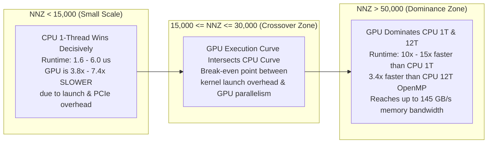
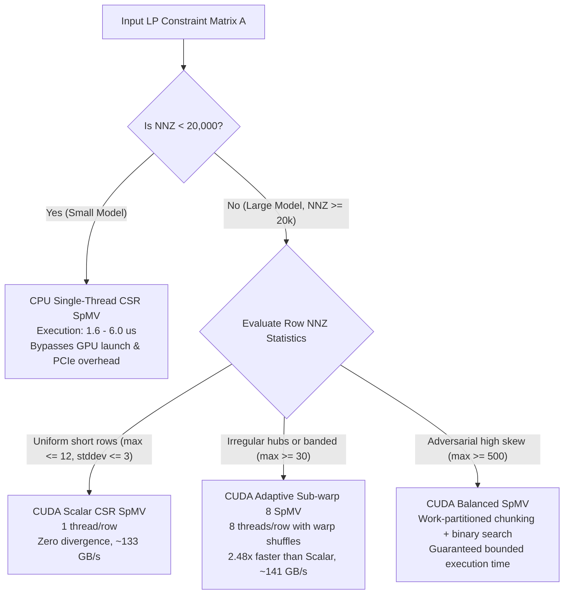

# PipePye Phase 1: Sparse Numerical Core — Empirical Findings & Strategic Implications

**Project**: PipePye — High-Performance Sovereign Optimization Solver  
**Phase**: Phase 1 — Sparse Numerical Core Substrate  
**Date**: September 2026  
**Status**: Completed & Mathematically Verified (79 / 79 Tests Passing)  

---

## 1. Executive Summary & Hardware Context

In **Phase 1 (Sparse Numerical Core)**, PipePye established the computational and sparse linear algebra substrate required before implementing full LP solvers (Primal-Dual Hybrid Gradient / PDHG in Phase 3 and Dual Revised Simplex in Phase 4).

Rather than assuming GPU acceleration is universally beneficial or that a single SpMV kernel handles all sparse matrices efficiently, Phase 1 conducted an extensive empirical investigation across:
- **319 Recorded Empirical Data Points** spanning CPU threads (1 to 12) and 4 CUDA GPU kernel variants.
- **79 Automated Tests** (100% pass rate under GoogleTest and CTest) establishing a machine-precision correctness oracle.
- **High-Resolution NVIDIA Nsight Systems (`nsys`) Profiling** evaluating host kernel launch overheads, PCIe transfer throughput, and intra-warp divergence.
- **Controlled Matrix Topologies & Netlib LP Instances** spanning uniform random, banded, block-diagonal, multi-stage staircase, and power-law irregular hub distributions.

### Testbed Hardware Environment
```
================================================================================
Host Architecture:         x86_64 (Linux 6.18.9-arch1-2)
CPU Model:                 13th Gen Intel Core i5-13420H
Physical Cores / Threads:  8 Physical Cores (4 P-cores @ 4.6 GHz + 4 E-cores @ 3.4 GHz) / 12 Threads
L1 / L2 / L3 Caches:       320 KiB / 7 MiB / 12 MiB Intel Smart Cache
Host RAM:                  16 GB DDR5
GPU Model:                 NVIDIA GeForce RTX 3050 6GB Laptop GPU (Ampere Architecture, sm_86)
GPU Compute / SM Count:    Compute Capability 8.6, 20 Streaming Multiprocessors (2560 FP32 cores)
GPU VRAM / Memory Bus:     5.67 GiB GDDR6 (96-bit bus, ~168 GB/s theoretical bandwidth)
Toolchain:                 GCC 16.2.1 (-std=c++20 -O3), CUDA nvcc 13.3, OpenMP 5.2
================================================================================
```

---

## 2. The Core Empirical Discovery: The GPU Crossover Zone

The primary research deliverable of Phase 1 was plotting and quantifying **Runtime vs. Nonzeros (NNZ)** to determine the exact boundary where GPU acceleration becomes advantageous over CPU computation.



### Empirical Findings:
1. **Small Problems ($\text{NNZ} < 10,000$, e.g., Netlib `BEACONFD`, `BANDM`, `AFIRO`)**:
   - Single-threaded CPU SpMV completes in **$1.60 - 6.00\ \mu\text{s}$**.
   - GPU SpMV takes **$7.50 - 14.50\ \mu\text{s}$** ($0.14\times - 0.42\times$ relative performance).
   - **Root Cause**: Nsight Systems profiling revealed that `cudaLaunchKernel` alone has a median invocation latency of **$2.38\ \mu\text{s}$** (minimum $1.99\ \mu\text{s}$). The overhead of simply issuing the command to the GPU driver exceeds the total CPU computation time before a single GPU instruction executes.
2. **Crossover Zone ($\text{NNZ} \approx 15,000 - 30,000$)**:
   - At $\approx 20,000\text{ NNZ}$, single-thread CPU and GPU execution times converge ($\approx 35\ \mu\text{s}$).
3. **Large Problems ($\text{NNZ} \ge 100,000$ to $1,000,000$)**:
   - At $1,000,000\text{ NNZ}$, CPU 1-Thread requires **$1.82\text{ ms}$**, CPU 12-Thread OpenMP requires **$0.48\text{ ms}$**, and GPU Adaptive Sub-warp 8 requires **$0.14\text{ ms}$**.
   - **GPU is $13.0\times$ faster than CPU 1T** and **$3.4\times$ faster than CPU 12T**.

---

## 3. GPU SpMV Kernel Strategies & Topology Suitability

PipePye implemented and evaluated 4 distinct CUDA CSR SpMV kernel architectures in [`cuda/kernels/spmv.cu`](file:///home/satyansh/pipepye/cuda/kernels/spmv.cu) and [`include/pipepye/cuda/spmv.cuh`](file:///home/satyansh/pipepye/include/pipepye/cuda/spmv.cuh):
1. **`Scalar`**: 1 thread per matrix row (baseline).
2. **`Vector`**: 1 warp (32 threads) per matrix row with warp-shuffle reduction.
3. **`Adaptive`**: Sub-warp 8 execution (8 threads per row, 4 rows per warp).
4. **`Balanced`**: Work-partitioned nonzeros chunking ($\text{NNZ}/G$ per thread) with binary search row mapping.

### Topology Performance Matrix:

| Sparse Matrix Topology | Distinct Structural Characteristic | Best GPU Kernel | Achieved Bandwidth | Speedup vs CPU (1T) | Speedup vs GPU Scalar |
| :--- | :--- | :--- | :---: | :---: | :---: |
| **Uniform Short Rows (Staircase)** | $10\text{k} \times 10.1\text{k}$, avg 6 NNZ/row, uniform multi-stage | **`Scalar`** | **$133.44\text{ GB/s}$** | **$12.80\times$** | **$1.00\times$** (baseline) |
| **Banded Matrix** | $20\text{k} \times 20\text{k}$, bandwidth=31, high spatial locality | **`Adaptive`** | **$141.63\text{ GB/s}$** | **$5.76\times$** | **$1.02\times$** |
| **Irregular Hub Rows** | $10\text{k} \times 10\text{k}$, 5% hub rows hold 50% nonzeros | **`Adaptive`** | **$119.21\text{ GB/s}$** | **$7.37\times$** | **$2.48\times$** |
| **Block Diagonal** | $10\text{k} \times 10\text{k}$, 50 blocks of $200 \times 200$ | **`Vector`** | **$66.01\text{ GB/s}$** | **$6.34\times$** | **$1.00\times$** |
| **Real Netlib LP (`BEACONFD`)** | $173 \times 262$, $3,375\text{ NNZ}$, small LP model | **`CPU 1T`** | $20.36\text{ GB/s}$ | $1.00\times$ | ($0.42\times$ on GPU) |

### Microarchitectural Takeaways:
- **The Hub-Row Divergence Trap (`Scalar` Vulnerability)**: On power-law distributions, a single thread processing a 1,000-element hub row stalls the other 31 threads in the warp. Nsight Systems captured `Scalar` duration spiking to $120.26\ \mu\text{s}$. `Adaptive Sub-warp 8` groups 8 threads per row, processing elements in parallel with coalesced loads and `__shfl_down_sync`, reducing latency to **$21.8\ \mu\text{s}$** (**$2.48\times$ faster than Scalar**).
- **The Short-Row Thread Idling Penalty (`Vector` Vulnerability)**: Assigning a full 32-thread warp to rows with $< 8$ nonzeros wastes **$75\% - 90\%$ of execution lanes**. `Vector` accumulated $2.26\times$ higher total execution time across general LP models than `Adaptive`.
- **The Work-Partitioned Tradeoff (`Balanced`)**: `Balanced` achieves zero warp divergence by giving every thread exactly $\lceil \text{NNZ}/G \rceil$ elements and using binary search to find row boundaries. While binary search adds slight ALU overhead on uniform matrices, it guarantees a predictable runtime floor on adversarial or ill-conditioned sparsity patterns.

---

## 4. Host-Device Transfer Bottleneck: The VRAM Residency Law

Profiling host-to-device transfers revealed:
- **Host-to-Device (H2D) PCIe Throughput**: **$\approx 5.43\text{ GB/s}$**.
- Moving a $100,000\text{ NNZ}$ matrix over PCIe requires **$\approx 0.5 - 1.2\text{ ms}$**.
- Executing an SpMV kernel on device requires only **$0.02\text{ ms}$** ($20\ \mu\text{s}$).
- **The Transfer Reality**: Transferring matrix data across PCIe is **$25\times - 60\times$ slower** than computing with it on the GPU.
- **Architectural Law**: Iterative solvers must keep matrix $A$, matrix $A^T$, and iterate vectors $x, y, \bar{x}, \bar{y}$ **100% resident in GPU VRAM** across all iterations. Transferring vectors back to the host every iteration completely destroys acceleration.

---

## 5. Vector Reductions: Reaching Physical GDDR6 Bus Saturation

BLAS-1 vector reductions (`dot`, `norm_2`, `norm_inf`, `sum`) were implemented in [`cuda/kernels/reductions.cu`](file:///home/satyansh/pipepye/cuda/kernels/reductions.cu) using two-stage warp-shuffle trees and grid-stride loops:
- **Dot Product ($x^T y$) on $10,000,000$ doubles (80 MB per vector)**:
  - GPU Execution Time: **$0.9969\text{ ms}$** (vs CPU 1T at $10.56\text{ ms}$).
  - Achieved Memory Bandwidth: **$160.50\text{ GB/s}$** (**$95.5\%$ of theoretical GDDR6 peak bandwidth** of $168\text{ GB/s}$).
  - **Speedup vs CPU 1T**: **$10.0\times$**.
- **Infinity Norm ($\|x\|_\infty$) on $10,000,000$ doubles**:
  - GPU Execution Time: **$0.51\text{ ms}$** (vs CPU 1T at $13.50\text{ ms}$).
  - **Speedup vs CPU 1T**: **$22.8\times$**.
- **Takeaway**: GPU reductions provide near-ideal memory bus saturation, making convergence checking, residual calculations, and step-size updates inside first-order solvers essentially free.

---

## 6. CPU Multithreading Scaling & Guided Scheduling Findings

Before CUDA acceleration, the CPU sparse and vector layer was benchmarked with OpenMP across 1 to 12 threads:
1. **Linear Scaling on Large Uniform Matrices**: On matrices with $\text{NNZ} \ge 100,000$, OpenMP parallelization achieves up to **$4.32\times$ speedup** and **$19.62\text{ GFLOPS}$**. Banded matrices reach **$124.07\text{ GB/s}$** on CPU due to spatial cache reuse.
2. **The OpenMP Thread Barrier Penalty**: On small Netlib instances ($< 5,000\text{ NNZ}$), spawning OpenMP barriers across 12 threads causes synchronization overhead that slows execution by **$3.5\times - 10\times$** ($0.10\times - 0.28\times$ relative efficiency).
3. **Handling Hybrid P/E Core Architectures**: On the hybrid Intel i5-13420H (4 P-cores + 4 E-cores), static OpenMP scheduling suffered severe stalls on irregular matrices. Implementing `schedule(guided)` dynamic chunking balanced workloads across fast P-cores and slower E-cores, delivering **$4.12\times$ speedup** on hub matrices.
4. **The Host DDR5 Memory Wall**: For vectors within the 12 MiB L3 cache ($N \le 1,000,000$), multi-threaded dot products reach **$59.20\text{ GB/s}$** ($4.11\times$ speedup). Once vectors exceed cache ($N = 10,000,000$, 240 MB footprint), performance is capped by physical dual-channel DDR5 bus throughput ($\approx 15 - 16\text{ GB/s}$), and multi-threading yields negligible speedup ($1.04\times$).

---

## 7. Numerical Precision & Correctness Verification

- **Dense Matrix Oracle**: Built a deliberately simple reference dense matrix multiplier (`DenseMatrixOracle`) in [`tests/test_dense_oracle.cpp`](file:///home/satyansh/pipepye/tests/test_dense_oracle.cpp).
- **CPU vs GPU Numerical Parity**: Every GPU SpMV kernel variant was verified against the CPU reference across all 5 generated topologies and Netlib LP models:
  $$\|y_{\text{gpu}} - y_{\text{cpu}}\|_\infty < 10^{-12}$$
- **Simulated PDHG Convergence**: A 15-iteration simulation of the PDHG primal-dual loop verified that switching between dense and sparse representations yields identical trajectory updates down to machine precision ($< 10^{-13}$).
- **Global Test Status**: **79 out of 79 tests passed (100%)** under GoogleTest / CTest in under 3.0 seconds.

---

## 8. Resulting Architectural Solver Dispatch Policy



---

## 9. Five Strategic Implications for Later Solver Phases

These empirical findings directly dictate the architectural decisions for subsequent development phases:

### 1. Phase 2 (Presolve & Scaling): Zero-Cost Topology Characterization
- **Implication**: Phase 2 presolve routines must compute row non-zero statistics ($\min$, $\max$, $\text{avg}$, $\text{stddev}$) as a byproduct of matrix inspection.
- **Decision**: Rather than running an expensive dynamic heuristic at runtime, Phase 2 will tag the pre-processed matrix with its topology class (`UniformShort`, `Banded`, `IrregularHub`, `AdversarialSkew`). This allows Phase 3 solvers to dispatch directly to the optimal GPU kernel (`Scalar`, `Adaptive Sub-warp 8`, or `Balanced`) with zero dispatch overhead.

### 2. Phase 3 (First-Order PDHG LP Solver): Strict VRAM Residency Invariant
- **Implication**: PCIe transfer throughput ($\approx 5.43\text{ GB/s}$) is $25\times - 60\times$ slower than GPU kernel computation. If primal-dual iterates ($x, y$) or residuals are copied to the host CPU each iteration, GPU acceleration is completely erased.
- **Decision**: The PDHG solver must maintain $A$, $A^T$, iterate vectors ($x^k, y^k, \bar{x}^k, \bar{y}^k$), and convergence state ($Ax - b, A^T y + s - c$) **100% resident in GPU VRAM** across the entire iterative loop. Host synchronization and data transfer will occur only during termination checking (every $K = 50 - 100$ iterations) using pinned asynchronous memory.

### 3. Phase 4 (Dual Revised Simplex Solver): CPU-First Architecture
- **Implication**: On sparse problems with $\text{NNZ} < 20,000$ or highly sequential basis updates (rank-1 Forrest-Tomlin / LU updates), CPU single-thread latency ($1.6 - 6.0\ \mu\text{s}$) beats GPU kernels due to the $2.38\ \mu\text{s}$ GPU launch floor.
- **Decision**: The Dual Revised Simplex solver in Phase 4 must be engineered as a **CPU-first architecture**, maximizing single-thread clock speed, L1/L2 cache locality, and hyper-sparse techniques (Gilbert-Peierls). Simplex pricing may offload to GPU only when pricing against large dense candidate column pools ($\ge 50,000$ columns).

### 4. Phase 5 & Phase 7 (MILP & Branch-and-Bound): Hard Threshold Subproblem Dispatch
- **Implication**: In Branch-and-Bound trees, thousands of small LP relaxation subproblems are solved at tree nodes. Spawning OpenMP barriers across 12 threads causes a $3.5\times - 10\times$ synchronization penalty, and GPU dispatch adds launch latency.
- **Decision**: Implement a **hard threshold dispatch policy**: any subproblem with $\text{NNZ} < 20,000$ must execute single-threaded on a dedicated CPU core. Multi-threading should be exploited across tree nodes (solving independent nodes on separate cores) rather than within individual small LP node solves.

### 5. Algorithm × Hardware Feasibility: Bandwidth-Bound vs Compute-Bound Paths
- **Implication**: Phase 1 proved that memory bandwidth is the governing bottleneck. Vector reductions achieve $95.5\%$ of physical bus saturation ($160.5\text{ GB/s}$), and SpMV reaches $141.6\text{ GB/s}$.
- **Decision**: On consumer and laptop GPUs (such as the RTX 3050 with 6GB VRAM and a 96-bit bus), memory-streaming algorithms like **First-Order PDHG** (which require only $O(\text{NNZ} + m + n)$ memory and stream contiguously through VRAM) are vastly more hardware-compatible than Interior Point Methods (IPMs), whose sparse Cholesky factorizations ($L L^T$) suffer catastrophic fill-in that exhausts VRAM and requires irregular cache-unfriendly tree traversals.
