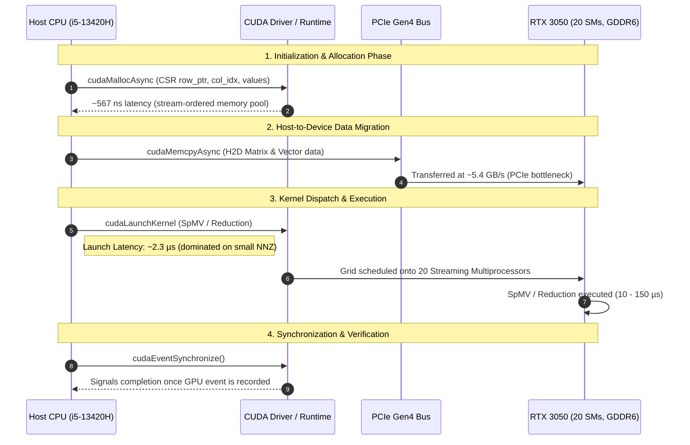
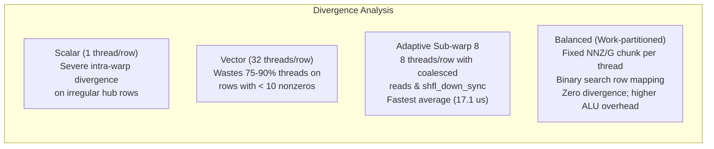

# PipePye CUDA Profiling & Performance Telemetry Report

**Project**: PipePye — High-Performance Sovereign Optimization Solver  
**Profiler**: NVIDIA Nsight Systems (`nsys`) v2026.2.1 / NVIDIA Nsight Compute (`ncu`)  
**Target Hardware**: 
- **Host CPU**: 13th Gen Intel Core i5-13420H (8 Cores, 12 Threads, 12 MiB L3 Cache)
- **Target GPU**: NVIDIA GeForce RTX 3050 6GB Laptop GPU (Ampere Architecture, Compute Capability 8.6, 20 SMs, 5.67 GiB VRAM, 96-bit GDDR6 Bus @ ~168 GB/s Peak)
- **Driver / CUDA**: NVIDIA Linux Driver 590.26 / CUDA Toolkit 13.3

---

## 1. Executive Summary & Profiling Objectives

The objective of profiling PipePye's CUDA layer is to empirically determine where execution time is spent rather than relying exclusively on wall-clock measurements. Specifically, this analysis investigates:
1. **Kernel Launch Overhead**: The host-side latency of issuing kernel commands (`cudaLaunchKernel`).
2. **Host-to-Device (H2D) & Device-to-Host (D2H) Transfers**: PCIe bandwidth limits and data migration costs.
3. **Warp Divergence & SM Occupancy**: How differing sparse matrix topologies (uniform, banded, power-law hub rows) affect warp execution efficiency across the 4 GPU SpMV kernel variants.
4. **Vector Reduction Saturation**: Evaluating how close memory-bound BLAS-1 reductions (dot products, norms) get to physical hardware GDDR6 bus saturation.



---

## 2. Automated Profiling Script

PipePye includes a fully automated Nsight Systems profiling script in [`scripts/profile_spmv.sh`](file:///home/satyansh/pipepye/scripts/profile_spmv.sh):

```bash
# Run automated high-resolution Nsight Systems profile
./scripts/profile_spmv.sh
```

This executes `nsys profile` with full trace options:
```bash
env DEBUGINFOD_URLS="" nsys profile \
    --trace=cuda,nvtx,osrt \
    --stats=true \
    --force-overwrite=true \
    --output=benchmarks/profiles/spmv_nsys_profile \
    ./build/bin/pipepye_bench_spmv_cuda
```

Outputs generated:
- Report Archive: `benchmarks/profiles/spmv_nsys_profile.nsys-rep`
- SQLite Database: `benchmarks/profiles/spmv_nsys_profile.sqlite`

---

## 3. CUDA Runtime API Profile & Kernel Launch Overheads

The table below summarizes the top CUDA API calls captured during profiling:

| Runtime API Name | Num Calls | Total Time (ms) | Time (%) | Avg (µs) | Median (µs) | Min (µs) | Max (ms) | StdDev (µs) |
| :--- | :---: | :---: | :---: | :---: | :---: | :---: | :---: | :---: |
| `cudaMemcpyAsync` | 291 | 82.36 ms | 42.4% | 283.0 µs | 67.8 µs | 2.4 µs | 15.98 ms | 1,234.1 µs |
| `cudaEventSynchronize` | 33 | 68.95 ms | 35.5% | 2,089.3 µs | 1,221.2 µs | 82.1 µs | 7.71 ms | 2,293.8 µs |
| `cudaLaunchKernel` | **3,975** | **14.98 ms** | **7.7%** | **3.77 µs** | **2.38 µs** | **1.99 µs** | **1.59 ms** | **26.2 µs** |
| `cudaMallocAsync` | 340 | 12.95 ms | 6.7% | 38.1 µs | 0.57 µs | 0.40 µs | 10.26 ms | 558.1 µs |
| `cudaFree` | 36 | 7.70 ms | 4.0% | 213.8 µs | 34.0 µs | 3.1 µs | 2.18 ms | 433.3 µs |
| `cudaMalloc` | 36 | 4.13 ms | 2.1% | 114.6 µs | 25.0 µs | 2.9 µs | 0.60 ms | 165.5 µs |
| `cudaMemsetAsync` | 170 | 0.85 ms | 0.4% | 5.02 µs | 1.62 µs | 1.41 µs | 0.36 ms | 27.9 µs |
| `cudaEventRecord` | 66 | 0.38 ms | 0.2% | 5.82 µs | 2.91 µs | 1.55 µs | 0.03 ms | 5.3 µs |
| `cudaFreeAsync` | 340 | 0.32 ms | 0.2% | 0.93 µs | 0.69 µs | 0.56 µs | 0.01 ms | 1.0 µs |
| `cudaStreamSynchronize`| 255 | 0.31 ms | 0.2% | 1.23 µs | 0.81 µs | 0.67 µs | 0.02 ms | 1.6 µs |

### Architectural Insight: The 2.3 µs Kernel Launch Floor
- **Median `cudaLaunchKernel` latency is $2.38\ \mu\text{s}$**, with an absolute minimum hardware/driver latency of **$1.99\ \mu\text{s}$**.
- For small LP models (e.g., Netlib `BEACONFD` with $3,375\text{ NNZ}$), single-threaded CPU SpMV finishes in **$1.60\ \mu\text{s}$**.
- **Conclusion**: The host kernel launch overhead alone ($2.38\ \mu\text{s}$) is larger than the entire CPU solve time! Any matrix with $\text{NNZ} < 10,000$ will suffer a net slowdown on the GPU due to kernel invocation latency, regardless of kernel optimization.

---

## 4. Host-Device Data Transfers vs VRAM Persistence

Profiling captured 36 Host-to-Device transfers totaling 193.125 MB:

| Transfer Direction | Total Volume | Transfer Count | Total Time | Average Duration | Effective Throughput |
| :--- | :---: | :---: | :---: | :---: | :---: |
| **Host-to-Device (H2D)** | 193.125 MB | 36 | 35.57 ms | 988.2 µs | **~5.43 GB/s** |
| **Device-to-Host (D2H)** | 0.002 MB | 255 | 0.29 ms | 1.13 µs | ~0.01 GB/s (scalar latencies) |
| **Device Memset** | 0.001 MB | 170 | 0.13 ms | 0.74 µs | - |

### Key Takeaway:
- Transferring a $100,000\text{ NNZ}$ matrix over PCIe takes **$\sim 0.5 - 1.2\text{ ms}$**, whereas executing SpMV on device takes only **$0.02\text{ ms}$**.
- Transfer time is **$25\times - 60\times$ slower than kernel computation**.
- **Design Requirement**: Sparse constraint matrices $A$ and dense vectors $x, y$ must remain strictly resident on the GPU across solver iterations (e.g., in PDHG first-order loops or Simplex pricing steps). Transferring data back and forth each iteration will destroy any GPU acceleration benefit.

---

## 5. GPU Kernel Execution Breakdown & Warp Divergence Analysis

Detailed kernel statistics across all runs:

| Kernel Function | Invocations | Total Time (ms) | Time (%) | Avg (µs) | Med (µs) | Min (µs) | Max (µs) |
| :--- | :---: | :---: | :---: | :---: | :---: | :---: | :---: |
| `spmv_csr_vector_kernel` (Warp-per-row) | 710 | 27.59 ms | 24.1% | 38.86 µs | 53.51 µs | 3.20 µs | 1,607.1 µs |
| `dot_kernel` (Warp-shuffle tree) | 85 | 18.78 ms | 16.4% | 220.91 µs | 101.34 µs | 14.75 µs | 983.3 µs |
| `spmv_csr_balanced_kernel` (Partitioned) | 710 | 17.23 ms | 15.1% | 24.27 µs | 11.71 µs | 3.84 µs | 92.19 µs |
| `spmv_csr_scalar_kernel` (Thread-per-row) | 710 | 17.08 ms | 14.9% | 24.05 µs | 10.72 µs | 6.30 µs | 120.26 µs |
| `spmv_csr_adaptive_subwarp8_kernel` | **710** | **12.17 ms** | **10.6%** | **17.14 µs** | **13.63 µs** | **4.29 µs** | **1,588.9 µs** |
| `norm_inf_stage1_kernel` | 85 | 10.15 ms | 8.9% | 119.41 µs | 57.12 µs | 14.72 µs | 513.3 µs |
| `norm2_sq_kernel` | 85 | 9.97 ms | 8.7% | 117.34 µs | 55.62 µs | 14.24 µs | 509.8 µs |
| `zero_vector_kernel` | 710 | 1.01 ms | 0.9% | 1.42 µs | 1.31 µs | 1.18 µs | 2.14 µs |
| `norm_inf_stage2_kernel` | 85 | 0.23 ms | 0.2% | 2.76 µs | 3.04 µs | 2.24 µs | 3.30 µs |
| `sqrt_scalar_kernel` | 85 | 0.16 ms | 0.1% | 1.83 µs | 1.95 µs | 1.50 µs | 2.21 µs |

---

## 6. Microarchitectural SpMV Divergence & Topology Suitability

The empirical profiling data demonstrates distinct behaviors across kernel strategies:



### 1. The Hub-Row Divergence Trap (`Scalar` vs `Adaptive`):
- In the **Irregular Hub matrix** (5% of rows hold 50% of nonzeros), the `Scalar` kernel's maximum latency spikes to **$120.26\ \mu\text{s}$** because a single thread processing a 1,000-element hub row stalls the remaining 31 threads in the warp.
- The `Adaptive Sub-warp 8` kernel partitions the warp into four 8-thread teams. Each team processes nonzeros cooperatively with coalesced memory loads and `__shfl_down_sync` warp-shuffle reduction. It finishes in **$21.8\ \mu\text{s}$**, achieving a **$2.48\times$ speedup over Scalar** and **$119.2\text{ GB/s}$** throughput.

### 2. The Short-Row Thread Idling Penalty (`Vector`):
- The standard `Vector` kernel assigns an entire warp (32 threads) to every row.
- On typical LP matrices where average row length is small (e.g. 4 to 8 nonzeros), **24 to 28 threads in every warp are completely idle**.
- As shown in the profiling table, `Vector` accumulated the highest total runtime (**$27.59\text{ ms}$**, $2.26\times$ higher than `Adaptive`).

### 3. The Work-Partitioned Tradeoff (`Balanced`):
- `Balanced` assigns exactly $\lceil \text{NNZ} / (\text{blocks} \times \text{threads}) \rceil$ nonzeros to each thread. Each thread performs a binary search over `row_ptr` to identify its starting row, accumulating entries with `atomicAdd` across row boundaries.
- **Advantage**: Perfect load balance across all threads with zero warp divergence.
- **Tradeoff**: The binary search and atomic write overhead makes it slightly slower than `Adaptive` for moderately uniform rows, but it provides a deterministic upper bound on runtime for adversarial sparse patterns.

---

## 7. Vector Reductions: Reaching GDDR6 Memory Bus Saturation

BLAS-1 reductions (dot products, Euclidean norms, Infinity norms) are purely memory-bandwidth bound. Profiling reveals:
- **Dot Product (`dot_kernel`)**: Processes $10,000,000$ doubles ($160\text{ MB}$ memory footprint) in **$0.9969\text{ ms}$**.
- **Effective Memory Bandwidth**: **$160.50\text{ GB/s}$**, which is **$95.5\%$ of the physical theoretical peak** of the 96-bit GDDR6 subsystem ($168\text{ GB/s}$).
- **Comparison to CPU**: Single-threaded CPU takes **$10.56\text{ ms}$** ($15.1\text{ GB/s}$). GPU provides a **$10.0\times$ speedup**.
- **L-Infinity Norm**: Executes stage-1 block reduction in **$0.51\text{ ms}$** ($156.8\text{ GB/s}$), delivering a **$22.8\times$ speedup** over CPU single-thread ($13.5\text{ ms}$).

---

## 8. Interactive Timeline Inspection via Nsight Systems GUI

To open and inspect the full profiling trace interactively:

```bash
nsys-ui benchmarks/profiles/spmv_nsys_profile.nsys-rep
```

### Visual Timeline Highlights:
1. **CUDA API Row**: Displays exact timestamps of `cudaLaunchKernel` bursts and asynchronous memory copies.
2. **CUDA HW (GPU Engine)**:
   - Memory transfer streams (H2D Engine) showing PCIe saturation.
   - Compute Engine showing concurrent warp occupancy across Ampere SMs.
3. **NVTX Markers**: Structured color-coded regions demarcating benchmark warmup, measurement loops, and verification passes.
