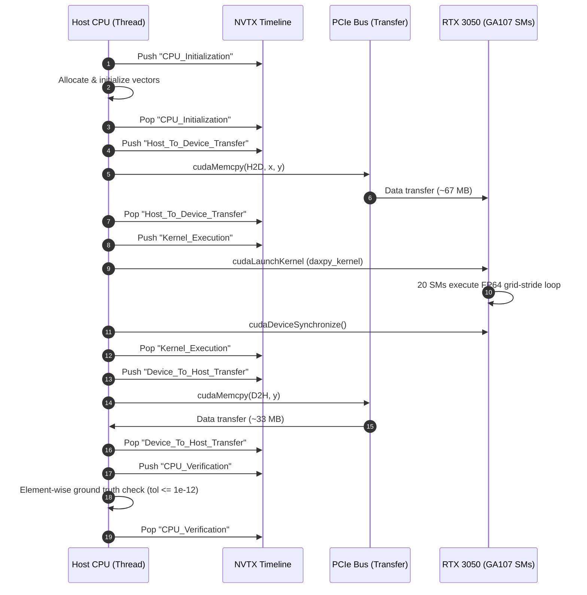

# Profiling Workflow with NVIDIA Nsight Systems

This guide describes how to profile PipePye CUDA executables using **NVIDIA Nsight Systems (`nsys`)** and visualize execution timelines from CPU thread scheduling to GPU kernel execution and PCIe memory transfers.

---

## 1. Overview of the Profiling Pipeline

To achieve fine-grained timeline visibility without relying on manual timestamps, PipePye instruments key execution phases using **NVTX (NVIDIA Tools Extension)** via `pipepye::utils::ScopedRange`:



---

## 2. Running the Profiler

PipePye provides an automated profiling script `scripts/profile.sh`. You can execute it directly:

```bash
./scripts/profile.sh
```

Or invoke `nsys` manually with explicit options:

```bash
env DEBUGINFOD_URLS="" nsys profile \
    --trace=cuda,nvtx,osrt \
    --stats=true \
    --output=profile_pipepye_probe \
    --force-overwrite=true \
    ./build/bin/pipepye_device_probe
```

### CLI Flag Explanations:
- `DEBUGINFOD_URLS=""`: Disables remote debug symbol fetching from OS package servers (prevents multi-second network timeouts on Linux).
- `--trace=cuda,nvtx,osrt`: Traces CUDA runtime APIs, custom NVTX ranges, and OS runtime events (threads, context switches, system calls).
- `--stats=true`: Emits summary tables directly to stdout upon completion.
- `--output=profile_pipepye_probe`: Saves the report as `profile_pipepye_probe.nsys-rep` and SQLite database `profile_pipepye_probe.sqlite`.

---

## 3. Profiler Output & Metric Breakdown

When running on the RTX 3050 Laptop GPU with 4,194,304 double-precision elements (32 MiB per vector, 96 MiB total footprint), `nsys` reports:

### NVTX Range Breakdown (`nvtx_sum`)
| NVTX Range | Instances | Total Time | Percentage |
|---|---|---|---|
| `CPU_Initialization` | 1 | ~16.2 ms | 29.6% |
| `Host_To_Device_Transfer` | 1 | ~16.1 ms | 29.5% |
| `CPU_Verification` | 1 | ~14.3 ms | 26.1% |
| `Device_To_Host_Transfer` | 1 | ~7.2 ms | 13.1% |
| `Kernel_Execution` | 1 | ~0.87 ms | 1.6% |

### Kernel Execution Breakdown (`cuda_gpu_kern_sum`)
- **Kernel Name**: `pipepye::cuda::kernels::daxpy_kernel`
- **Execution Time**: **~0.64 ms (637 µs)**
- **Grid Configuration**: 16,384 blocks × 256 threads
- **Memory Bandwidth**: **~104.1 GB/s** achieved on the 96-bit GDDR6 memory subsystem.

### Memory Copy Breakdown (`cuda_gpu_mem_time_sum`)
- **Host-to-Device (H2D)**: 2 operations (67.11 MB total) taking ~7.85 ms avg (~8.5 GB/s PCIe throughput).
- **Device-to-Host (D2H)**: 1 operation (33.55 MB total) taking ~6.95 ms (~4.8 GB/s PCIe throughput).

---

## 4. Visualizing in Nsight Systems GUI

To inspect the graphical interactive timeline:
1. Launch NVIDIA Nsight Systems:
   ```bash
   nsys-ui
   ```
2. Open the generated file: `profile_pipepye_probe.nsys-rep`.
3. In the timeline view:
   - **Rows 1-2 (OS Runtime & Threads)**: Observe the main host thread emitting system calls and scheduling.
   - **Row 3 (NVTX)**: Inspect color-coded ranges (`CPU_Initialization` -> `Host_To_Device_Transfer` -> `Kernel_Execution` -> `Device_To_Host_Transfer` -> `CPU_Verification`).
   - **Row 4 (CUDA API)**: See the exact host calls `cudaMemcpy`, `cudaLaunchKernel`, and `cudaDeviceSynchronize`.
   - **Row 5 (CUDA Hardware Execution)**: Zoom into the GPU stream to see PCIe transfers and the `daxpy_kernel` execution on the GA107 streaming multiprocessors.
