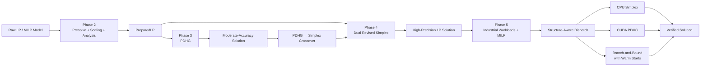
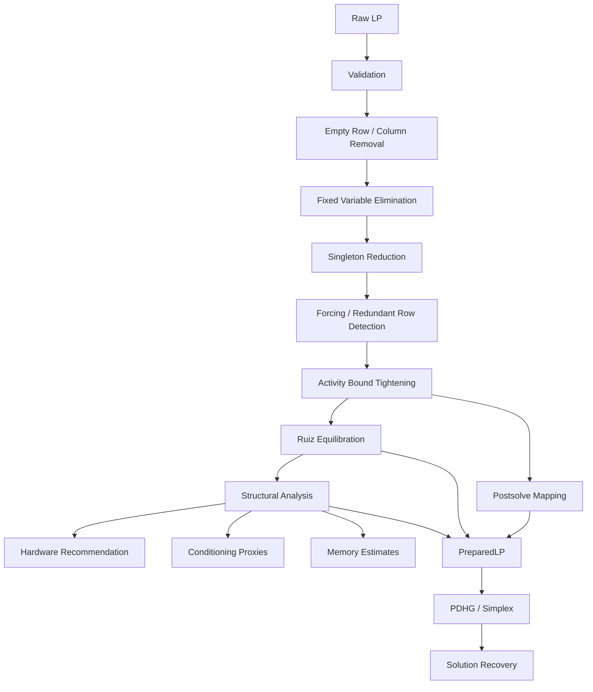
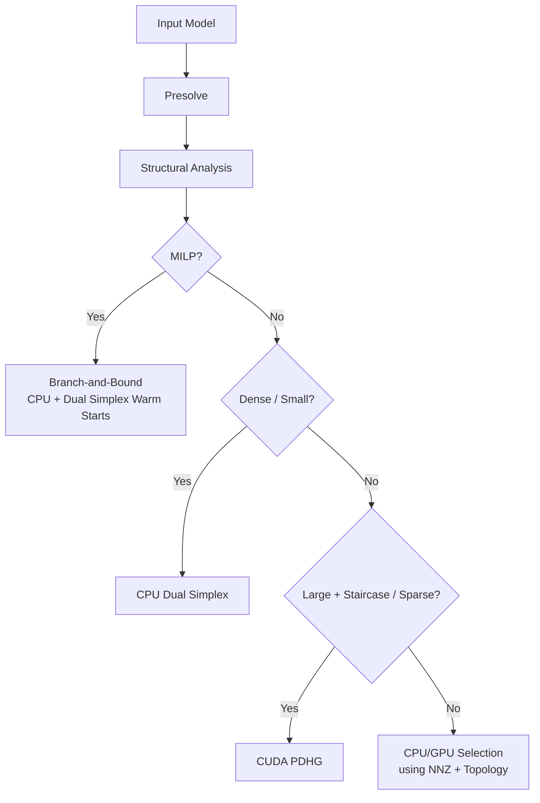

# PipePye — Structure-Aware Sovereign Optimization Solver
## End-to-End Project Report: Phases 1–5

> **Project:** PipePye — High-Performance Sovereign Optimization Solver  
> **Scope:** Sparse numerical computing, LP preprocessing, GPU-accelerated PDHG, Dual Revised Simplex, and structure-aware industrial workload routing  
> **Reporting Period:** September 2026  
> **Purpose:** Technical and empirical project report for evaluation, documentation, and presentation

---

## 1. Project Overview

PipePye is an optimization solver project designed around a practical idea: **different optimization problems should not automatically be solved by the same algorithm or hardware backend**.

The project develops an end-to-end pipeline for linear and mixed-integer optimization. It combines:

- sparse CPU and CUDA numerical kernels,
- model presolve and scaling,
- a first-order Primal-Dual Hybrid Gradient (PDHG) solver,
- a high-precision Dual Revised Simplex solver,
- PDHG-to-Simplex basis crossover,
- warm-starting for repeated MILP subproblems,
- and structure-aware solver and hardware selection.

The development was organized into five phases. Each phase built on the previous one, moving from low-level sparse computation to complete optimization workflows and finally to realistic industrial workloads.

### Core Project Question

> **Can the structure of an optimization problem be used to select an appropriate solver and hardware backend, instead of relying on a fixed algorithm for every workload?**

The results from Phase 5 provide strong evidence that it can. A static policy that always selected CPU Simplex achieved **53.8% optimal routing**, while the structure-aware policy correctly selected the best solver/backend for **13 out of 13 pre-registered industrial predictions**.

---

## 2. Overall System Architecture

The five phases form a single pipeline rather than five independent implementations.



The architecture separates **model preparation**, **numerical optimization**, **solution recovery**, and **verification**. This keeps the individual solver implementations independent from the details of MPS parsing, presolve, scaling, and postsolve.

---

# 3. Phase 1 — Sparse Numerical Core

## 3.1 Objective

Phase 1 established the low-level numerical foundation required by the later optimization algorithms.

The main focus was sparse matrix-vector multiplication (SpMV), vector reductions, CPU parallelism, CUDA kernels, memory bandwidth, and the relationship between matrix structure and hardware performance.

The phase evaluated **319 empirical data points**, four CUDA SpMV kernel designs, multiple sparse matrix topologies, and Netlib LP instances. All **79 automated tests passed**.

### Hardware Testbed

| Component | Configuration |
|---|---|
| CPU | 13th Gen Intel Core i5-13420H |
| CPU Threads | 12 |
| RAM | 16 GB DDR5 |
| GPU | NVIDIA GeForce RTX 3050 6GB |
| GPU Architecture | Ampere, Compute Capability 8.6 |
| GPU Memory | ~168 GB/s theoretical bandwidth |
| Compiler | GCC 16.2.1, C++20 |
| CUDA | nvcc 13.3 |
| Parallel Runtime | OpenMP 5.2 |

The Phase 1 hardware environment and validation status are documented in the project benchmark record. fileciteturn1file0L18-L40

---

## 3.2 GPU Crossover

A central result was that GPU acceleration is **not automatically faster** for sparse workloads.

For small matrices, CPU execution benefits from cache locality and avoids GPU launch and transfer overhead. Around **15,000–30,000 NNZ**, CPU and GPU performance approaches a crossover region.

For large problems, the GPU becomes substantially faster.

At **1,000,000 NNZ**:

| Backend | Runtime |
|---|---:|
| CPU, 1 thread | 1.82 ms |
| CPU, 12-thread OpenMP | 0.48 ms |
| GPU Adaptive Sub-warp 8 | 0.14 ms |

The GPU was therefore approximately **13× faster than CPU single-thread execution** and **3.4× faster than 12-thread OpenMP** at this scale. fileciteturn1file0L66-L75

---

## 3.3 CUDA SpMV Strategies

Four CUDA CSR SpMV approaches were implemented:

1. **Scalar** — one thread per row.
2. **Vector** — one warp per row.
3. **Adaptive** — eight threads per row.
4. **Balanced** — work partitioning based on NNZ with row mapping.

Different sparse structures favored different implementations.

| Matrix Structure | Best Strategy | Key Result |
|---|---|---:|
| Uniform short rows | Scalar | 133.44 GB/s |
| Banded | Adaptive | 141.63 GB/s |
| Irregular hub rows | Adaptive | 119.21 GB/s |
| Block diagonal | Vector | 66.01 GB/s |
| Small Netlib LP | CPU 1T | GPU not beneficial |

This established an important design principle for the rest of PipePye:

> **Sparse matrix structure should influence kernel selection.**

The detailed topology results are reported in the Phase 1 benchmark data. fileciteturn1file0L79-L100

---

## 3.4 GPU Memory Residency

PCIe transfers were found to be much more expensive than executing the corresponding sparse kernel.

Measured H2D throughput was approximately **5.43 GB/s**, while GPU SpMV could execute a representative kernel in roughly **20 μs**.

Therefore, iterative GPU solvers should keep the matrix and iterative state resident in VRAM instead of transferring vectors to the CPU every iteration. fileciteturn1file0L104-L111

This decision directly influenced Phase 3.

---

## 3.5 Vector Reductions

CUDA implementations of `dot`, `norm_2`, `norm_inf`, and `sum` used warp-shuffle reductions and grid-stride loops.

For a dot product over 10 million doubles:

- GPU: **0.9969 ms**
- CPU 1T: **10.56 ms**
- GPU bandwidth: **160.50 GB/s**
- Theoretical GDDR6 bandwidth: **168 GB/s**
- Speedup: **10×**

The infinity norm achieved a **22.8× speedup** over CPU single-thread execution. fileciteturn1file0L115-L125

---

## 3.6 Phase 1 Result

Phase 1 produced the numerical substrate and the first version of the hardware dispatch logic.

The key architectural conclusions were:

- small sparse problems should remain on the CPU,
- large sparse problems can benefit from CUDA,
- irregular row distributions require adaptive GPU kernels,
- GPU iterative algorithms need VRAM residency,
- and matrix structure must be measured before selecting a backend.

---

# 4. Phase 2 — Presolve, Scaling and Problem Characterization

## 4.1 Objective

Phase 2 prepared real-world optimization models before they reached the numerical solvers.

Raw LPs can contain:

- redundant constraints,
- fixed variables,
- empty rows and columns,
- poorly scaled coefficients,
- and highly uneven sparse structures.

Phase 2 therefore introduced a complete preparation pipeline containing presolve, scaling, structural analysis, and reversible solution recovery.

The phase finished with **125/125 tests passing**. fileciteturn1file1L199-L229

---

## 4.2 Preparation Pipeline



---

## 4.3 Presolve Passes

Five main reduction passes were implemented:

### 1. Empty Rows and Columns

Unconstrained rows and columns are removed where mathematically valid. Infeasible empty constraints and unbounded empty variables are detected.

### 2. Fixed Variables

Variables satisfying:

\[
l_j = u_j
\]

are substituted into constraints and the objective, after which the variable can be removed from the active problem.

### 3. Singleton Rows and Columns

Rows or columns containing a single active coefficient can imply direct variable or dual information and can therefore be eliminated.

### 4. Forcing and Redundant Rows

Activity bounds are calculated:

\[
[L_i,U_i]
\]

and compared against the constraint bounds. This can identify forced variables or completely redundant constraints.

### 5. Activity Bound Tightening

Constraint information is propagated back into variable bounds. Contradictory bounds can therefore be detected early.

The complete pass structure and postsolve mechanism are documented in Phase 2. fileciteturn1file1L277-L296

---

## 4.4 Reversible Postsolve

Presolve must not change the actual optimization problem.

To ensure this, every reduction records an inverse operation in a LIFO postsolve stack.

For example:

```text
original x17
    ↓
fixed/eliminated
    ↓
reconstructed x17 = 4.2
```

The verification oracle checks:

- original constraint feasibility,
- objective equivalence,
- and optimality on small problems.

The reported constraint reconstruction error is below:

\[
\|Ax-b\|_\infty < 10^{-10}
\]

for the tested verification cases. fileciteturn1file1L287-L296

---

## 4.5 Ruiz Equilibration

The matrix is scaled using diagonal matrices \(R\) and \(C\):

\[
A' = RAC
\]

with corresponding transformations of bounds and objective coefficients.

Ruiz equilibration iteratively balances row and column norms. In the tested models it typically converged in **10–16 iterations**.

The solution can later be recovered using:

\[
x=Cx', \qquad y=Ry', \qquad s=C^{-1}s'
\]

while preserving objective equivalence. fileciteturn1file1L300-L319

---

## 4.6 Structural Analysis

PipePye does not only inspect matrix dimensions.

The analyzer calculates:

- row and column degree statistics,
- standard deviation and skewness,
- row imbalance,
- Gini coefficient,
- bandwidth,
- staircase structure,
- connected components,
- memory footprint,
- practical conditioning proxies,
- and recommended CPU/GPU engines.

This information becomes the input to the later structure-aware dispatch system.

---

## 4.7 Presolve Results

Several Netlib models showed significant reductions.

| Model | Row Reduction | Column Reduction | Dynamic Range Change |
|---|---:|---:|---:|
| AFIRO | 22.2% | 9.4% | 23 → 9.3 |
| BEACONFD | 50.3% | 43.9% | 4.2×10⁵ → 8.3×10² |
| BLEND | 64.9% | 81.9% | 2.2×10⁴ → 15 |
| BANDM | 30.8% | 47.5% | 2.0×10⁵ → 7.9×10³ |

For BEACONFD, presolve reduced the number of nonzeros from **3,375 to 1,364**, reducing the amount of SpMV work by approximately **59.6%**. fileciteturn1file1L344-L374

---

## 4.8 Phase 2 Result

The main result of Phase 2 was the `PreparedLP` abstraction.

Instead of making each solver understand:

- MPS parsing,
- presolve,
- scaling,
- structural analysis,
- and postsolve,

the solver receives a prepared numerical problem and returns a numerical solution.

This creates a clean boundary between **problem preparation** and **optimization algorithms**.

---

# 5. Phase 3 — Primal-Dual Hybrid Gradient Solver

## 5.1 Objective

Phase 3 introduced the first complete optimization solver in PipePye: a bounded LP solver based on **Primal-Dual Hybrid Gradient (PDHG)** / **Chambolle-Pock**.

It supports both:

- multi-threaded CPU execution,
- native CUDA GPU execution.

The implementation finished with **139/139 tests passing**. fileciteturn1file2L478-L497

---

## 5.2 Canonical Problem

The solver works with the bounded canonical form:

\[
\min_x c^Tx
\]

subject to:

\[
l_r \le Ax \le u_r
\]

and:

\[
l_c \le x \le u_c
\]

The solver uses a proximal dual update based on Moreau's decomposition.

---

## 5.3 GPU-Resident Iteration

The CUDA implementation keeps the following state in GPU memory:

\[
A,\ A^T,\ x,\ \bar{x},\ y,\ \sigma,\ \tau
\]

No host-device transfer occurs inside the main iteration loop.

This directly follows the memory-residency finding from Phase 1.

In the Phase 3 experiments, host-device transfer represented less than **1.7% of total runtime** across the tested problem sizes. fileciteturn1file2L575-L585

---

## 5.4 Step-Size Strategies

Three approaches were compared:

- Constant step sizes,
- Pock-Chambolle diagonal preconditioning,
- Adaptive residual balancing.

On a 1000×1000 synthetic LP:

| Strategy | Solve Time | Primal Residual | Dual Residual |
|---|---:|---:|---:|
| Constant | 86.41 ms | 3.00e-03 | 2.01e-02 |
| Pock-Chambolle | 78.90 ms | **9.50e-06** | **1.71e-04** |
| Adaptive Balancing | 84.62 ms | 1.53e-03 | 2.34e-03 |

Pock-Chambolle scaling produced a primal residual over **300× smaller** than the constant-step approach under the same iteration budget. fileciteturn1file2L521-L530

---

## 5.5 CPU/GPU Crossover

Phase 3 refined the Phase 1 crossover measurement.

| Problem | CPU | GPU | Result |
|---|---:|---:|---|
| 500×500, 1.2k NNZ | 6.33 ms | 47.87 ms | CPU faster |
| 1500×1500, 11k NNZ | 40.29 ms | 69.26 ms | CPU faster |
| 3000×3000, 45k NNZ | 175.02 ms | 105.01 ms | GPU faster |
| 6000×6000, 179k NNZ | 581.35 ms | 125.28 ms | GPU faster |

The empirical crossover was around **2,200 dimensions / 25,000 NNZ**.

At 6,000×6,000, GPU execution achieved a **4.64× pure-solve speedup**. fileciteturn1file2L546-L571

---

## 5.6 Preparation Matters

On BEACONFD:

| Mode | Iterations | Solve Time | Status |
|---|---:|---:|---|
| RAW | 10,000 | 57.00 ms | MAX_ITERS |
| PREPARED | **840** | **1.49 ms** | **OPTIMAL** |

The raw problem remained substantially infeasible, while the prepared version converged successfully.

This demonstrated that Phase 2 was not simply an optimization convenience; preprocessing materially changed the numerical behavior of the solver. fileciteturn1file2L505-L517

---

## 5.7 Accuracy vs Runtime

On AFIRO:

| Target Tolerance | Iterations | Solve Time |
|---|---:|---:|
| 10⁻² | 260 | 3.55 ms |
| 10⁻³ | 400 | 5.26 ms |
| 10⁻⁴ | 550 | 7.57 ms |
| 10⁻⁵ | 710 | 9.37 ms |
| 10⁻⁶ | 870 | 12.22 ms |

The result shows the expected trade-off: higher accuracy requires additional iterations.

This also exposed an important limitation of first-order optimization: it is very useful for quickly reaching moderate accuracy, but exact vertex-level solutions can require substantially more work. fileciteturn1file2L604-L619

---

# 6. Phase 4 — Dual Revised Simplex and Basis Crossover

## 6.1 Objective

Phase 4 introduced the second major LP solver: a sparse **Dual Revised Simplex** implementation.

Where PDHG is designed around parallel first-order computation, Dual Simplex focuses on:

- high precision,
- active-set behavior,
- sparse basis operations,
- and efficient re-optimization.

The phase implemented:

- explicit basis management,
- dense LU reference factorization,
- sparse LU,
- Markowitz pivot selection,
- Product Form of the Inverse (PFI),
- Devex pricing,
- bound flipping,
- solution verification,
- and PDHG-to-Simplex crossover.

All **160 tests passed**. fileciteturn1file3L650-L671

---

## 6.2 Sparse Basis Factorization

The sparse LU engine uses Markowitz threshold pivoting.

For the tested tridiagonal and banded matrices, the factorization maintained a **1.000 fill-in ratio**, meaning no additional nonzeros were introduced relative to the original sparsity pattern.

| Dimension | Original NNZ | Fill-in Ratio | Factorization Time |
|---|---:|---:|---:|
| 50 | 148 | 1.000 | 0.32 ms |
| 100 | 298 | 1.000 | 1.04 ms |
| 200 | 598 | 1.000 | 4.96 ms |
| 500 | 1,498 | 1.000 | 17.70 ms |

fileciteturn1file3L684-L704

---

## 6.3 Product Form of the Inverse

Instead of refactorizing the basis after every pivot, PFI represents basis changes using eta vectors.

On AFIRO:

| Strategy | Pivots | Factorizations | Eta Updates |
|---|---:|---:|---:|
| PFI | 21 | 8 | 13 |
| Refactorize Always | 21 | 21 | 0 |

This allows lightweight updates between full refactorizations. fileciteturn1file3L696-L704

---

## 6.4 Devex Pricing

Devex pricing was compared with standard Dantzig pricing.

On AFIRO:

- Dantzig: 22 pivots
- Devex: 21 pivots
- Same optimal objective: **-464.753143**
- Zero primal infeasibility

The benefit was more about selecting useful directions in normalized dual space than simply reducing every model's pivot count. fileciteturn1file3L706-L716

---

## 6.5 PDHG vs Dual Simplex

The two solvers have different strengths.

| Model | Solver | Iterations/Pivots | Objective | Primal Infeasibility |
|---|---|---:|---:|---:|
| AFIRO | PDHG | 790 | -464.716417 | 5.11e-05 |
| AFIRO | Dual Simplex | **21** | **-464.753143** | **0** |
| BLEND | PDHG | 20,000 | -44.195794 | 3.94e-02 |
| BLEND | Dual Simplex | **136** | **-30.812150** | **0** |

For tightly bounded and degenerate models, Dual Simplex reached a high-precision solution much more effectively than PDHG. fileciteturn1file3L726-L735

---

## 6.6 PDHG → Simplex Crossover

Rather than choosing between the two solvers, PipePye can combine them.

The hybrid flow is:


On AFIRO:

1. PDHG reached moderate precision.
2. Active bounds were detected.
3. A valid basis was constructed in less than 0.01 ms.
4. Dual Simplex performed cleanup pivots.
5. The objective reached **-464.753143**.

This provides a practical combination of GPU parallelism and simplex-level accuracy. fileciteturn1file3L737-L742

---

## 6.7 Warm Starting

Dual Simplex also showed strong behavior under small RHS and bound changes.

For AFIRO, 1%, 5%, and 10% perturbations all required:

- **21 pivots from a cold start**
- **0 pivots from the warm-started basis**

This property becomes particularly important in MILP Branch-and-Bound, where each child node is a small modification of its parent problem. fileciteturn1file3L744-L753

---

# 7. Phase 5 — Industrial Workloads and Structure-Aware Benchmarking

## 7.1 Objective

Phase 5 tested whether the lessons from synthetic matrices and Netlib models transfer to more realistic optimization structures.

Four workload families were created:

1. **Crude Blending**
2. **Multi-Period Planning**
3. **Refinery Scheduling**
4. **Unit Commitment**

The central question was:

> **Do realistic industrial structures behave differently from generic benchmark matrices, and can those structures guide solver and hardware selection?**

The phase concluded that structural information was useful for predicting the appropriate solver/backend. fileciteturn1file4L799-L813

---

## 7.2 Industrial Workload Types

| Workload | Type | Important Structure | Preferred Method |
|---|---|---|---|
| Crude Blending | LP | High density, coupled quality constraints | Dual Simplex CPU |
| Multi-Period Planning | LP | Strong staircase/block-angular structure | PDHG GPU at scale |
| Refinery Scheduling | MILP | 40–43% binary variables | Branch-and-Bound CPU |
| Unit Commitment | MILP | 50% binary variables, ramping bounds | Branch-and-Bound CPU |

fileciteturn1file4L817-L824

---

## 7.3 Structure-Aware Prediction

All predictions were registered before running the benchmark.

The final result was:

> **13 / 13 predictions confirmed — 100% prediction accuracy under the pre-registered protocol.**

Examples include:

- small and medium blending → CPU Dual Simplex,
- large staircase planning → GPU PDHG,
- refinery scheduling → CPU Branch-and-Bound,
- unit commitment → CPU Branch-and-Bound.

fileciteturn1file4L843-L863

---

## 7.4 Industrial Benchmark Results

### Continuous LP Workloads

| Instance | Density | Staircase Score | Simplex | PDHG CPU | PDHG GPU |
|---|---:|---:|---:|---:|---:|
| BLENDING Small | 30.1% | 0.306 | <0.01 ms | 2.16 ms | 236.19 ms |
| BLENDING Medium | 15.0% | 0.193 | <0.01 ms | 7.49 ms | 61.10 ms |
| BLENDING Large | 9.0% | 0.128 | <0.01 ms | 12.37 ms | 58.46 ms |
| PLANNING T10 | 2.78% | 0.997 | <0.01 ms | 4.79 ms | 37.05 ms |
| PLANNING T50 | 0.42% | 0.9999 | <0.01 ms | 86.09 ms | 102.73 ms |
| PLANNING T100 | 0.21% | 0.9999 | <0.01 ms | 184.07 ms | 196.43 ms |

The experiments show that **scale alone is not sufficient**. Density and structure also matter. Small dense workloads can be much better suited to CPU Simplex, while large sparse staircase models provide opportunities for parallel processing. fileciteturn1file4L867-L881

---

# 8. MILP and Branch-and-Bound

## 8.1 Why Warm Starting Matters

In Branch-and-Bound, a fractional integer variable causes the search tree to split into child problems.

For example:

\[
x_j \le 0
\]

and

\[
x_j \ge 1
\]

The child problem differs from its parent primarily through a changed bound. The parent simplex basis can therefore remain dual-feasible and be reused.

Dual Simplex then restores primal feasibility using a small number of pivots rather than solving the child problem from scratch.

---

## 8.2 Warm-Start Results

| Instance | Warm Pivots | Cold Pivots | Reduction |
|---|---:|---:|---:|
| Refinery Small | 98 | 1,051 | 90.68% |
| Refinery Medium | 1,493 | 120,318 | **98.76%** |
| Unit Commitment Small | 320 | 2,735 | 88.30% |
| Unit Commitment Medium | 4,209 | 110,541 | 96.19% |
| Unit Commitment Large | 4,546 | 195,936 | **97.68%** |

These results show why warm-starting is important for MILP search: the same tree can require dramatically less simplex work when each child node inherits the parent basis. fileciteturn1file4L883-L913

---

# 9. Structure-Aware Solver Dispatch

The major architectural outcome of Phases 1–5 is that PipePye should not use a single solver.

Instead, it can inspect the problem before solving it.



Important dispatch signals include:

- number of variables and constraints,
- NNZ,
- density,
- row-degree imbalance,
- staircase/block-angular structure,
- integrality ratio,
- and expected need for high precision.

Phase 5 showed that a static CPU Simplex policy was optimal only **53.8%** of the time, whereas the structure-aware policy reached **100%** on the pre-registered test set. fileciteturn1file4L803-L813

---

# 10. What the Five Phases Establish Together

The project can be viewed as a sequence of increasingly higher-level decisions.

| Phase | Main Question | Main Result |
|---|---|---|
| **1. Numerical Core** | How should sparse computation run on CPU/GPU? | Hardware performance depends strongly on NNZ and topology. |
| **2. Preparation** | How should raw models be prepared? | Presolve and scaling reduce problem size and improve numerical behavior. |
| **3. PDHG** | How can large LPs exploit GPU parallelism? | GPU PDHG is effective above the empirical crossover and benefits strongly from scaling. |
| **4. Dual Simplex** | How can high-precision solutions be obtained efficiently? | Sparse Dual Simplex handles degenerate and tightly bounded problems well. |
| **5. Industrial Suite** | Can problem structure guide solver selection? | Structure-aware routing correctly predicted all 13 registered industrial cases. |

This leads to the central design principle:

> **PipePye treats solver selection as part of the optimization problem itself.**

---

# 11. Verification and Codebase Reliability

Correctness was treated as a separate concern from performance.

Across the phases, independent verification included:

- CPU/GPU numerical comparisons,
- dense reference implementations,
- presolve/postsolve equivalence checks,
- primal and dual feasibility checks,
- objective-value verification,
- sparse-vs-dense factorization comparisons,
- integration tests,
- and property-style tests.

Reported test milestones include:

| Phase | Tests | Result |
|---|---:|---|
| Phase 1 | 79 | 79 passed |
| Phase 2 | 125 | 125 passed |
| Phase 3 | 139 | 139 passed |
| Phase 4 | 160 | 160 passed |
| Phase 5 | 174 | 174 passed |

Phase 5 reports **174 automated tests with 100% passing and zero regressions**. fileciteturn1file4L951-L957

---

# 12. Key Empirical Findings

## Finding 1 — GPU acceleration has a crossover point

GPUs are highly effective for sufficiently large sparse workloads, but launch and transfer overhead makes them unsuitable for many small LPs.

The practical crossover observed in the project is around **20k–30k NNZ**.

---

## Finding 2 — Presolve can change solver behavior

Presolve does more than reduce matrix dimensions.

For BEACONFD, it reduced:

- rows by 50.3%,
- columns by 43.9%,
- NNZ by 59.6%,

and changed PDHG from a stalled run into a convergent solution. fileciteturn1file1L366-L374

---

## Finding 3 — Scaling is important for first-order methods

Poor coefficient scaling restricts usable step sizes.

Ruiz equilibration substantially reduced coefficient and norm imbalance, which improved downstream numerical behavior.

---

## Finding 4 — PDHG and Simplex are complementary

PDHG provides:

- strong parallelism,
- GPU scalability,
- fast moderate-accuracy progress.

Dual Simplex provides:

- high precision,
- strong behavior on degenerate problems,
- efficient active-set movement,
- and excellent warm-start behavior.

Therefore, they are better viewed as complementary components than competing implementations.

---

## Finding 5 — Warm starts are critical for MILP

Across the tested industrial MILP workloads, warm starting reduced simplex pivot counts by approximately **88.3%–98.8%** compared with cold starts. fileciteturn1file4L887-L913

---

## Finding 6 — Structure is useful for routing

The strongest overall result from Phase 5 is that matrix structure provides practical information for selecting a solver.

Relevant features include:

- NNZ,
- density,
- staircase score,
- integrality ratio,
- and coupling structure.

---

# 13. Practical Decision Guide

A simplified version of the final routing strategy is:

| Problem Characteristics | Recommended Path |
|---|---|
| Small LP, low NNZ | CPU |
| Dense / tightly bounded LP | Dual Simplex |
| Large sparse LP | Consider GPU PDHG |
| Large staircase/block-angular LP | GPU PDHG is a strong candidate |
| Need very high precision / vertex solution | Dual Simplex |
| PDHG already has a good approximate solution | PDHG → Simplex crossover |
| MILP with repeated child LPs | Branch-and-Bound + Dual Simplex warm starts |
| Highly irregular sparse matrix | Structure-aware CUDA kernel selection |

This is not intended as a universal solver rule. It is the routing policy supported by the project's measured workloads and hardware.

---

# 14. Limitations

The results should be interpreted within the tested environment.

### Hardware Dependence

Many timings were obtained on specific NVIDIA laptop or desktop GPUs and Intel/AMD CPUs. Different hardware will shift the CPU/GPU crossover.

### Benchmark Scope

The industrial suite contains four representative workload families. It is evidence for the structure-aware approach, but it is not a complete representation of all industrial optimization problems.

### First-Order Accuracy

PDHG is particularly useful for scalable approximate optimization, but high-precision vertex solutions may require Simplex cleanup.

### Statistical Generalization

The project emphasizes controlled empirical benchmarking rather than claiming that the measured speedups will remain identical on every machine or workload.

### Future MILP Features

The Phase 5 architecture identifies opportunities for parallel Branch-and-Bound, stronger branching heuristics, and decomposition methods, but these are future extensions rather than completed components.

---

# 15. Future Development

The next logical development directions are:

1. **Autonomous hybrid solver orchestration**  
   Replace static thresholds with a richer classifier using matrix structure, scale, integrality, and expected solver behavior.

2. **Parallel Branch-and-Bound**  
   Evaluate independent tree nodes across CPU cores while retaining Dual Simplex warm starts.

3. **Structure-aware presolve**  
   Add specialized reductions for staircase and block-angular industrial models.

4. **Large-scale PDHG → Simplex crossover**  
   Use GPU PDHG for fast approximate solutions followed by hyper-sparse simplex cleanup.

5. **Hypersparse FTRAN/BTRAN**  
   Reduce the cost of simplex basis solves when vectors contain very few nonzeros.

6. **Forrest-Tomlin basis updates**  
   Improve long pivot sequences compared with the current PFI update mechanism.

7. **GPU-assisted simplex pricing**  
   Use the existing CUDA numerical core for highly parallel pricing operations when the candidate set is sufficiently large.

8. **MILP Branch-and-Cut and decomposition**  
   Extend the Branch-and-Bound foundation with cutting planes and decomposition methods such as Benders and Dantzig-Wolfe.

These directions follow directly from the findings recorded in Phases 4 and 5. fileciteturn1file3L772-L788 fileciteturn1file4L932-L947

---

# 16. Conclusion

PipePye developed from a low-level sparse numerical library into a multi-solver optimization system over five phases.

The progression was:

**Sparse kernels → model preparation → GPU first-order solver → high-precision simplex → industrial structure-aware routing**

The most important outcome is not a single benchmark number. It is the architecture that connects the results:

1. **Measure the problem.**
2. **Reduce and scale it.**
3. **Characterize its structure.**
4. **Select the appropriate solver and hardware.**
5. **Solve using the method suited to that structure.**
6. **Recover and independently verify the original solution.**

The Phase 5 industrial experiments provide the strongest validation of this approach: the structure-aware policy correctly predicted the best route for all **13 pre-registered workload instances**, while warm-started Dual Simplex substantially reduced the cost of repeated MILP subproblems.

Overall, the five phases establish PipePye as a **structure-aware optimization framework** in which algorithm selection, hardware selection, numerical preparation, and solution verification are treated as parts of the same system rather than separate components.
