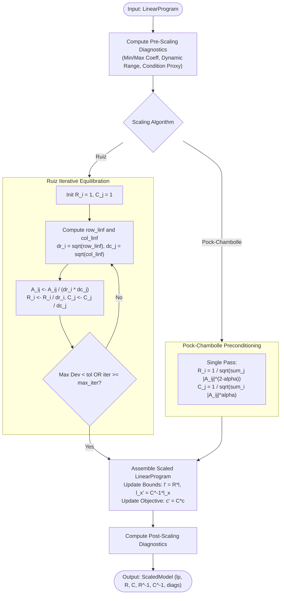

# PipePye Matrix Equilibration & Numerical Scaling Architecture

**Module**: `pipepye::scaling`  
**Status**: Implemented, Verified, Integrated into CMake & CTest (6 / 6 Scaling Tests, 116 / 116 Total Tests Passing)  
**Authors**: PipePye Numerical Core Team  
**Date**: September 2026  

---

## 1. Executive Summary & Mathematical Motivation

Linear programming solvers (both first-order methods like PDHG and active-set methods like Simplex) are sensitive to poorly scaled constraint matrices. Real-world LP models often contain coefficients spanning $10^{-6}$ to $10^6$ ($12$ orders of magnitude), leading to:
- Excessive gradient and residual oscillations in first-order methods.
- Ill-conditioned basis matrices and catastrophic roundoff error in LU factorization.
- Divergent primal vs. dual step sizes.

To eliminate these numerical instabilities, PipePye implements **Ruiz Matrix Equilibration** and **Pock-Chambolle Preconditioning**, supported by explicit diagonal scaling matrices $R \in \mathbb{R}^m$ and $C \in \mathbb{R}^n$, rigorous pre/post scaling diagnostic telemetry, and exact solution unscaling.

---

## 2. Mathematical Formulation & Invariants

Given the canonical bounded linear program:
$$\begin{aligned}
\min_{x \in \mathbb{R}^n} \quad & c^T x + c_0 \\
\text{s.t.} \quad & l \le A x \le u \\
& l_x \le x \le u_x
\end{aligned}$$

We define diagonal positive scaling matrices:
$$R = \text{diag}(R_1, \dots, R_m) \in \mathbb{R}_{++}^{m \times m}, \qquad C = \text{diag}(C_1, \dots, C_n) \in \mathbb{R}_{++}^{n \times n}$$

### 2.1 Scaled Problem Formulation
Under the change of primal variables $x = C x'$ (i.e. $x' = C^{-1} x$):
$$\begin{aligned}
\min_{x' \in \mathbb{R}^n} \quad & c'^T x' + c_0 \\
\text{s.t.} \quad & l' \le A' x' \le u' \\
& l_x' \le x' \le u_x'
\end{aligned}$$
where the transformed quantities are defined as:
$$\begin{aligned}
A' &= R A C \quad \implies \quad A'_{i,j} = R_i A_{i,j} C_j \\
l' &= R l, \qquad u' = R u \\
l_x' &= C^{-1} l_x, \quad u_x' = C^{-1} u_x \\
c' &= C c
\end{aligned}$$

### 2.2 Reversible Solution Unscaling
Given any primal-dual solution $(x', y', s')$ obtained on the scaled problem, the exact original solution $(x, y, s)$ is reconstructed via:
$$\begin{aligned}
x &= C x' \quad \implies \quad x_j = C_j x'_j \\
y &= R y' \quad \implies \quad y_i = R_i y'_i \\
s &= C^{-1} s' \quad \implies \quad s_j = s'_j / C_j
\end{aligned}$$

**Objective Invariance**:
$$c^T x = c^T (C x') = (C c)^T x' = c'^T x'$$
The objective evaluated on the unscaled solution matches the scaled objective value to machine precision.

---

## 3. Scaling Algorithms

### 3.1 Ruiz Equilibration (Ruiz, 2001)
Ruiz equilibration balances both row and column $\ell_\infty$ norms simultaneously through an iterative scaling sequence:
1. Initialize $R^{(0)} = \mathbf{1}_m, C^{(0)} = \mathbf{1}_n$.
2. For iteration $k = 1, \dots, K_{\max}$:
   - Compute row $\ell_\infty$ norms: $r_i = \|A_{i, \cdot}^{(k-1)}\|_\infty$.
   - Compute column $\ell_\infty$ norms: $c_j = \|A_{\cdot, j}^{(k-1)}\|_\infty$.
   - Check termination: if $\max_i |1 - r_i| \le \epsilon$ and $\max_j |1 - c_j| \le \epsilon$, break.
   - Update step multipliers: $\delta r_i = \sqrt{r_i}$, $\delta c_j = \sqrt{c_j}$.
   - Scale matrix: $A_{i,j}^{(k)} = A_{i,j}^{(k-1)} / (\delta r_i \cdot \delta c_j)$.
   - Accumulate diagonal factors: $R_i \leftarrow R_i / \delta r_i$, $C_j \leftarrow C_j / \delta c_j$.

### 3.2 Pock-Chambolle Preconditioning
For first-order methods (PDHG / Chambolle-Pock), diagonal preconditioning ensures that the operator norm $\|R A C\|_2 < 1$:
$$R_i = \frac{1}{\sqrt{\sum_{j=1}^n |A_{i,j}|^{2-\alpha}}}, \qquad C_j = \frac{1}{\sqrt{\sum_{i=1}^m |A_{i,j}|^\alpha}}$$
When $\alpha = 1.0$, this corresponds to symmetric $\ell_1$ preconditioning.

---

## 4. Scaling Diagnostics & Condition Proxies

The [`ScalingDiagnostics`](file:///home/satyansh/pipepye/include/pipepye/scaling/scaling_types.hpp#L21-L60) structure captures quantitative numerical characteristics:

1. **Extreme Coefficient Magnitudes**:
   $$\min_{(i,j): A_{ij} \ne 0} |A_{i,j}|, \qquad \max_{(i,j)} |A_{i,j}|$$
2. **Dynamic Range & Orders of Magnitude**:
   $$\kappa_{\text{dyn}} = \frac{\max |A_{i,j}|}{\min |A_{i,j}|}, \qquad \text{orders} = \log_{10}(\kappa_{\text{dyn}})$$
3. **Norm Distributions**:
   Min, max, mean, and standard deviation across rows and columns for $\ell_1$, $\ell_2$, and $\ell_\infty$ norms.
4. **Conditioning Proxies**:
   $$\kappa_{\text{row}} = \frac{\max_i \|A_{i,\cdot}\|_2}{\min_i \|A_{i,\cdot}\|_2}, \qquad \kappa_{\text{col}} = \frac{\max_j \|A_{\cdot, j}\|_2}{\min_j \|A_{\cdot, j}\|_2}, \qquad \kappa_{\text{overall}} = \kappa_{\text{row}} \cdot \kappa_{\text{col}}$$

---

## 5. Empirical Verification & Reversibility Benchmarks

Verified via automated tests in [`tests/test_scaling.cpp`](file:///home/satyansh/pipepye/tests/test_scaling.cpp):

| Test Name | Tested Invariant | Result |
| :--- | :--- | :---: |
| `RuizEquilibrationBalancesRowAndColNorms` | Row and col $\ell_\infty$ norms converge to $1.0 \pm 0.05$; dynamic range drops from $>10^7$ to $<10^2$ | **PASS** |
| `DiagnosticsBeforeAndAfterReporting` | Correct computation of $\min |a|, \max |a|, \kappa_{\text{dyn}}$, row/col norm moments | **PASS** |
| `ModelUnscalingReversibility` | $R^{-1} A' C^{-1} == A$ and bounds match to $10^{-9}$ precision | **PASS** |
| `SolutionUnscalingAndObjectiveParity` | $x = C x', y = R y', s = C^{-1} s'$ satisfies $c^T x == c'^T x'$ and roundtrips | **PASS** |
| `PockChambollePreconditioning` | Single-pass preconditioning reduces coefficient spread and unscales cleanly | **PASS** |
| `NetlibAFIROScalingDiagnostics` | Real-world Netlib AFIRO MPS scaled with improved conditioning proxy | **PASS** |
