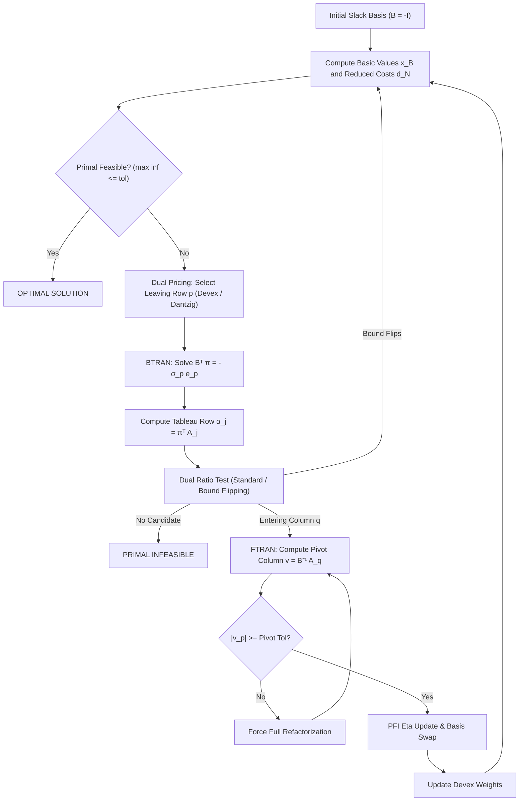
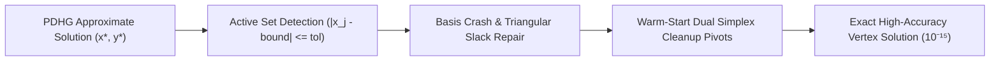

# Sparse Dual Revised Simplex & Basis Crossover Architecture

PipePye's Phase 4 introduces a high-performance **Sparse Dual Revised Simplex** solver and a **PDHG-to-Simplex Basis Crossover** engine. This document provides the mathematical foundation, algorithmic architecture, and software design of these components.

---

## 1. Problem Formulation and Slack Canonical Form

PipePye models general bounded linear programs in canonical form:

$$
\min_{x} c^T x + \text{offset}
$$

subject to:

$$
l_r \le A x \le u_r \quad (m \text{ constraints})
$$

$$
l_c \le x \le u_c \quad (n \text{ structural variables})
$$

### Slack Transformation
To perform revised simplex pivoting, we introduce explicit slack variables $s \in \mathbb{R}^m$ such that:

$$
A x - s = 0 \iff [A \quad -I] \begin{pmatrix} x \\ s \end{pmatrix} = 0
$$

with variable bounds:

$$
\bar{l} = \begin{pmatrix} l_c \\ l_r \end{pmatrix}, \quad \bar{u} = \begin{pmatrix} u_c \\ u_r \end{pmatrix}, \quad \bar{c} = \begin{pmatrix} c \\ 0 \end{pmatrix} \in \mathbb{R}^{n + m}.
$$

The augmented constraint matrix is $\bar{A} = [A \quad -I] \in \mathbb{R}^{m \times (n + m)}$. Structural variables occupy indices $0 \le j < n$; slack variables occupy indices $n \le j < n + m$, where column $n + i$ is simply $-e_i$.

---

## 2. Basis Representation and Partitioning

A simplex basis $B$ is a nonsingular $m \times m$ submatrix of $\bar{A}$ whose columns correspond to basic variables $\bar{x}_B$. Nonbasic variables $\bar{x}_N$ are held fixed at one of their bounds:

```text
Variable Status:
  - BASIC:     Variable is in the basis B (dimension m)
  - AT_LOWER:  Nonbasic variable x_j = l_j
  - AT_UPPER:  Nonbasic variable x_j = u_j
  - FIXED:     Nonbasic variable with l_j == u_j
  - FREE:      Nonbasic unconstrained variable (value = 0.0)
```

The fundamental simplex equations are:

$$
B \bar{x}_B + N \bar{x}_N = 0 \implies \bar{x}_B = - B^{-1} (N \bar{x}_N) = B^{-1} \left( -\sum_{j \in N} \bar{A}_{*, j} \bar{x}_j \right)
$$

### Dual Multipliers and Reduced Costs
Dual multipliers $y \in \mathbb{R}^m$ satisfy:

$$
B^T y = \bar{c}_B \implies y = B^{-T} \bar{c}_B
$$

For every variable $j \in [0, n + m - 1]$, its reduced cost $d_j$ is:

$$
d_j = \bar{c}_j - \bar{A}_{*, j}^T y
$$

- For structural variables ($j < n$): $d_j = c_j - A_{*, j}^T y$
- For slack variables ($j = n + i$): $d_{n + i} = 0 - (-e_i)^T y = y_i$
- For basic variables ($j \in B$): $d_j = 0$

### Dual Feasibility
A basis is dual feasible if for all nonbasic variables $j \in N$:
- $x_j = \bar{l}_j \implies d_j \ge -\epsilon_{\text{dual}}$
- $x_j = \bar{u}_j \implies d_j \le \epsilon_{\text{dual}}$
- $x_j$ is Fixed $\implies d_j \in \mathbb{R}$
- $x_j$ is Free $\implies |d_j| \le \epsilon_{\text{dual}}$

---

## 3. Sparse LU Factorization with Markowitz Threshold Pivoting

PipePye's `SparseLU` decomposes the basis matrix $B$ into:

$$
P B Q = L U
$$

where:
- $P, Q$ are row and column permutation matrices
- $L$ is unit lower triangular ($L_{i, i} = 1$)
- $U$ is upper triangular

### Markowitz Strategy with Partial Pivoting
At step $k$ of Gaussian elimination on the active submatrix:
1. For every active column $j$, compute $a_{\max, j} = \max_{i} |A_{i, j}|$.
2. Filter candidate pivots satisfying the threshold stability criterion:
   $$|A_{r, c}| \ge u \cdot a_{\max, c} \quad (u \in [0.01, 0.5] \text{, default } 0.1)$$
3. Among candidates, select the pivot minimizing the Markowitz fill-in cost:
   $$M(r, c) = (r_i - 1)(c_j - 1)$$
   where $r_i$ and $c_j$ are the nonzero counts of row $i$ and column $j$ in the remaining uneliminated submatrix.
4. Singletons ($M(r, c) = 0$) are pivoted immediately with zero fill-in.

---

## 4. Product Form of the Inverse (PFI) and Eta Updates

When column $p$ of $B$ is replaced by entering column $a_q$, refactorizing $B$ from scratch would cost $O(m^2)$ to $O(m^3)$. Instead, we compute the FTRAN of the entering column:

$$
v = B^{-1} a_q
$$

The updated basis satisfies $B_{\text{new}} = B E^{-1}$, so:

$$
B_{\text{new}}^{-1} = E B^{-1}
$$

The elementary eta matrix $E$ differs from the identity only in column $p$:
- Diagonal: $E_{p, p} = \frac{1}{v_p}$
- Off-diagonals: $E_{i, p} = -\frac{v_i}{v_p} \quad (i \ne p)$

### FTRAN (Forward Transformation)
To solve $B_{\text{new}} x = b$:
1. Base solve: $z_0 = B_0^{-1} b$ via `SparseLU::solve_ftran`
2. Forward eta application: for $t = 1 \dots k$:
   $$x_p \leftarrow x_p / v_p, \quad x_i \leftarrow x_i - v_i \cdot x_p$$

### BTRAN (Backward Transformation)
To solve $B_{\text{new}}^T y = b$:
1. Backward transposed eta application: for $t = k \dots 1$:
   $$w_p \leftarrow \frac{1}{v_p} \left( w_p - \sum_{i \ne p} v_i w_i \right)$$
2. Base solve transpose: $y = B_0^{-T} w_0$ via `SparseLU::solve_btran`

### Refactorization Policy
The basis is refactorized from scratch when:
- Number of eta updates reaches `max_updates_before_refactorize` (default 60)
- The pivot element $|v_p| < \tau_{\text{pivot}}$ ($10^{-8}$)
- Numerical residual $\|B x - b\|_\infty$ exceeds tolerance

---

## 5. Dual Revised Simplex Algorithm



### Devex Pricing
Rather than standard Dantzig pricing (which selects the largest primal infeasibility without regard to column scaling), Devex maintains dynamic approximation weights $\gamma_i \approx \|B^{-T} e_i\|_2^2$:
- Select leaving row: $p = \arg\max_i \left\{ \frac{\text{infeasibility}_i^2}{\gamma_i} \right\}$
- Update rule: after pivot with column $v$,
  $$\tau = \max\left(1.0, \frac{\|v\|_2^2}{v_p^2}\right)$$
  $$\gamma_i \leftarrow \max\left(\gamma_i, \left(\frac{v_i}{v_p}\right)^2 \gamma_p\right) \quad (i \ne p), \quad \gamma_p \leftarrow \frac{\tau}{v_p^2}$$

### Bound-Flipping Ratio Test
When row $p$ is infeasible, nonbasic variables can cross their bounds if their range is finite. Instead of stopping at the first ratio $\theta_1$, bound flipping checks whether shifting $x_j$ from $l_j$ to $u_j$ reduces the infeasibility of row $p$:
- If the shift $\Delta = |\alpha_j|(u_j - l_j)$ is less than the remaining infeasibility, the nonbasic variable flips bounds without a basis change!
- Only when a variable's shift exceeds the remaining infeasibility does it enter the basis.
- Result: dramatically reduced basis swaps, skipping degenerate pivots.

---

## 6. PDHG to Simplex Basis Crossover

First-order methods such as PDHG are excellent for rapid convergence on GPUs to moderate accuracies ($10^{-4}$ to $10^{-6}$), but exhibit slow asymptotic tail behavior when high precision ($10^{-10}$ to $10^{-15}$) or exact vertex solutions are required. The crossover engine converts an approximate PDHG solution $(x^*, y^*)$ into an exact simplex vertex basis:



1. **Active Set Detection**: Identifies active structural and slack bounds within tolerance $\tau_{\text{active}} (1 + |\text{bound}|)$. Non-active variables are candidate basics.
2. **Basis Crash & Repair**:
   - Sorts candidate basics by interiority distance $\min(x_j - l_j, u_j - x_j)$ descending.
   - Greedily selects linearly independent columns.
   - Fills remaining slots with slacks $-e_i$ for uncovered rows.
   - Validates nonsingularity with `BasisFactorization`.
3. **Warm-Start Clean-up**:
   - Initializes `DualSimplexSolver` with the crashed basis.
   - Simplex executes a handful of cleanup pivots to snap to the exact basic feasible solution.
