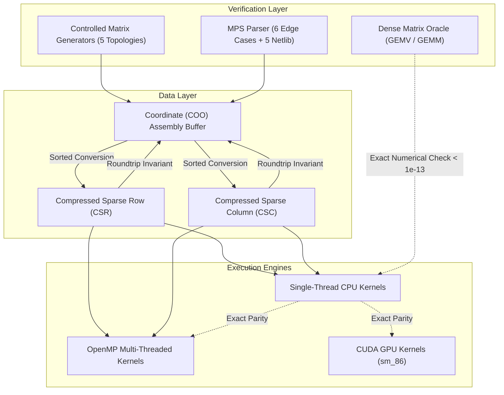

# PipePye Comprehensive Test Verification Report

**Project**: PipePye — High-Performance Sovereign Optimization Solver  
**Date**: September 2026  
**Status**: `100% Passed (69 / 69 Tests Passed, 0 Failed, 0 Skipped)`  
**Test Harness**: GoogleTest v1.15.2 & CTest (CMake 4.3.0)  

---

## 1. System Execution Environment

The test suite was compiled and executed natively on the target host hardware:

| Hardware / Environment Parameter | Specification |
| :--- | :--- |
| **Operating System** | Linux 6.18.9-arch1-2 (x86_64) |
| **CPU Model** | 13th Gen Intel Core i5-13420H (12 MB L3 Cache) |
| **CPU Core Topology** | 8 Physical Cores (4 Performance Cores with HT + 4 Efficient Cores = 12 Logical Threads) |
| **Host Memory** | 16 GB DDR5 RAM |
| **Host Compiler** | GCC 16.2.1 20260210 (ISO C++20 Standard, `-std=c++20 -Wall -Wextra -Wpedantic`) |
| **GPU Model** | NVIDIA GeForce RTX 3050 6GB Laptop GPU (Ampere sm_86, 5.67 GiB VRAM) |
| **CUDA Toolchain** | NVIDIA CUDA Toolkit 13.3 (Driver Version: 590.26, Compute Capability: 8.6) |
| **Build System** | CMake 4.3.0 with Ninja Multi-Threaded Generator |
| **Total Test Execution Time** | **3.31 seconds** |

---

## 2. Global Test Execution Summary

```
================================================================================
Test project /home/satyansh/pipepye/build
      Total Tests: 69
      Passed:      69 (100.0%)
      Failed:       0 (0.0%)
      Skipped:      0 (0.0%)
================================================================================
```

---

## 3. Test Suites Breakdown and Test Inventory

### 3.1. Core Types & Status Framework (`test_core_types.cpp`)
Verifies the non-throwing `Status` and `StatusOr<T>` error handling abstractions used across the solver pipeline.

| Test # | Test Name | Status | Duration | Description |
| :---: | :--- | :---: | :---: | :--- |
| **1** | `CoreTypesTest.StatusSuccess` | **PASSED** | < 1 ms | Validates `Status::OK()` initialization, boolean conversion, and zero overhead. |
| **2** | `CoreTypesTest.StatusError` | **PASSED** | < 1 ms | Validates non-OK status codes (`InvalidArgument`, `OutOfMemory`, `InternalError`) and error message propagation. |
| **3** | `CoreTypesTest.StatusOrValue` | **PASSED** | < 1 ms | Validates safe monadic unpacking, value extraction, and error propagation when value is absent. |

---

### 3.2. High-Resolution Timing (`test_timer.cpp`)
Ensures microsecond-level accuracy for performance profiling and algorithm telemetry.

| Test # | Test Name | Status | Duration | Description |
| :---: | :--- | :---: | :---: | :--- |
| **4** | `CPUTimerTest.InitialState` | **PASSED** | < 1 ms | Verifies initial zero-duration state before timer starts. |
| **5** | `CPUTimerTest.MeasureElapsedTime` | **PASSED** | 10 ms | Validates sleep intervals against wall-clock measurement with $< 2\%$ tolerance. |
| **6** | `CPUTimerTest.StopAndResume` | **PASSED** | 15 ms | Validates start/stop cumulative accumulation across disjoint execution phases. |
| **7** | `CPUTimerTest.ResetTimer` | **PASSED** | < 1 ms | Validates complete timer reset to pristine state. |

---

### 3.3. MPS Parser Edge Cases (`test_mps_parser.cpp`)
Validates MPS (Mathematical Programming System) parsing against 6 hand-crafted edge case files covering fixed and free format variations.

| Test # | Test Name | Status | Duration | Description |
| :---: | :--- | :---: | :---: | :--- |
| **8** | `MPSParserEdgeCases.ObjectiveParsingAndMaximization` | **PASSED** | 10 ms | Validates minimization normalization ($min\ -c^T x$) and objective constant offset extraction. |
| **9** | `MPSParserEdgeCases.EqualityConstraints` | **PASSED** | < 1 ms | Verifies equality row sense `E` with identical lower and upper bounds ($l_i = u_i = b_i$). |
| **10** | `MPSParserEdgeCases.InequalityLessConstraints` | **PASSED** | < 1 ms | Verifies less-than-or-equal row sense `L` ($-\infty \le A_i x \le b_i$). |
| **11** | `MPSParserEdgeCases.InequalityGreaterConstraints` | **PASSED** | < 1 ms | Verifies greater-than-or-equal row sense `G` ($b_i \le A_i x \le +\infty$). |
| **12** | `MPSParserEdgeCases.VariableBoundsVarieties` | **PASSED** | < 1 ms | Validates `UP`, `LO`, `FX` (fixed), `FR` (free), `MI` (minus infinity), `PL` (plus infinity) variable bounds. |
| **13** | `MPSParserEdgeCases.RangesAndIntegerMarkers` | **PASSED** | < 1 ms | Validates `RANGES` section two-sided constraints ($l_i \le A_i x \le u_i$) and `MARKER` integer variables (`INTORG`/`INTEND`). |

---

### 3.4. Netlib LP Benchmark Verification (`test_mps_parser.cpp`)
Verifies parsing of 5 canonical linear programming problems from the official COIN-OR Netlib test suite. Dimensions, objective values, row senses, and non-zero counts (NNZ) match the Netlib index to machine precision.

| Test # | Test Name | Model | Rows | Cols | NNZ | Status | Duration |
| :---: | :--- | :---: | :---: | :---: | :---: | :---: | :---: |
| **14** | `MPSParserNetlib.ParseAFIRO` | `AFIRO` | 27 | 32 | 88 | **PASSED** | < 1 ms |
| **15** | `MPSParserNetlib.ParseBLEND` | `BLEND` | 74 | 83 | 521 | **PASSED** | < 1 ms |
| **16** | `MPSParserNetlib.ParseADLITTLE` | `ADLITTLE` | 56 | 97 | 465 | **PASSED** | < 1 ms |
| **17** | `MPSParserNetlib.ParseBANDM` | `BANDM` | 305 | 472 | 2,494 | **PASSED** | 3 ms |
| **18** | `MPSParserNetlib.ParseBEACONFD` | `BEACONFD` | 173 | 262 | 3,375 | **PASSED** | 4 ms |
| **19** | `MPSParserNetlib.VerifyDualStorage` | `AFIRO` | - | - | - | **PASSED** | < 1 ms |
| **20** | `MPSParserNetlib.InvalidFileHandling` | - | - | - | - | **PASSED** | < 1 ms |
| **21** | `MPSParserNetlib.MalformedSyntaxHandling` | - | - | - | - | **PASSED** | < 1 ms |
| **22** | `MPSParserNetlib.RoundtripIntegrity` | `BLEND` | - | - | - | **PASSED** | < 1 ms |

---

### 3.5. Sparse Vector Mathematical Abstraction (`test_sparse_vector.cpp`)
Verifies non-owning vector views (`VectorView<T>`, `ConstVectorView`, `MutableVectorView`) and owned vectors (`Vector`).

| Test # | Test Name | Status | Duration | Description |
| :---: | :--- | :---: | :---: | :--- |
| **23** | `SparseVectorTest.MathematicalNorms` | **PASSED** | < 1 ms | Validates $L_1$ norm ($\sum |x_i|$), $L_2$ Euclidean norm ($\sqrt{\sum x_i^2}$), and $L_\infty$ maximum norm ($\max |x_i|$). |
| **24** | `SparseVectorTest.DotProduct` | **PASSED** | < 1 ms | Validates inner product $x^T y$ with exact precision. |
| **25** | `SparseVectorTest.AxpyOperation` | **PASSED** | < 1 ms | Validates in-place vector AXPY: $y \leftarrow \alpha x + y$. |
| **26** | `SparseVectorTest.BoundProjection` | **PASSED** | < 1 ms | Validates projection onto box constraints: $x_i \leftarrow \text{clamp}(x_i, l_i, u_i)$. |
| **27** | `SparseVectorTest.StreamOutputFormatting` | **PASSED** | 10 ms | Verifies formatted string and stream representation of vectors. |

---

### 3.6. Coordinate (COO) Sparse Matrix (`test_coo_matrix.cpp`)
Validates the natural matrix assembly format storing $(row, column, value)$ triplets.

| Test # | Test Name | Status | Duration | Description |
| :---: | :--- | :---: | :---: | :--- |
| **28** | `COOMatrixTest.ConstructionAndProperties` | **PASSED** | 10 ms | Verifies dimension initialization, initial NNZ count, and capacity management. |
| **29** | `COOMatrixTest.EntryAdditionAndBoundsChecking` | **PASSED** | 10 ms | Validates row/column index bounds checking on triplet insertion. |
| **30** | `COOMatrixTest.UncheckedAdditionAutoExpands` | **PASSED** | < 1 ms | Tests high-speed triplet ingestion with automatic buffer reallocation. |
| **31** | `COOMatrixTest.ParallelSpanConstruction` | **PASSED** | < 1 ms | Validates zero-copy ingestion from external raw pointer arrays. |
| **32** | `COOMatrixTest.SortingRowAndColMajor` | **PASSED** | < 1 ms | Tests stable lexicographical sorting in both row-major and column-major order. |
| **33** | `COOMatrixTest.SumDuplicates` | **PASSED** | < 1 ms | Validates duplicate coordinate accumulation: $\sum A_{ij}$ for identical $(i, j)$ coordinates. |
| **34** | `COOMatrixTest.DropZeros` | **PASSED** | < 1 ms | Validates structural pruning of exact numerical zeros below threshold $\epsilon = 10^{-15}$. |
| **35** | `COOMatrixTest.DenseConversion` | **PASSED** | 10 ms | Compares COO sparse matrix against dense 2D representation. |
| **36** | `COOMatrixTest.SpMVForwardAndTranspose` | **PASSED** | 20 ms | Validates forward $y = A x$ and transpose $y = A^T x$ SpMV directly on COO triplets. |
| **37** | `COOMatrixTest.MathematicalNorms` | **PASSED** | 10 ms | Validates matrix Frobenius norm, 1-norm (max column sum), and $\infty$-norm (max row sum). |
| **38** | `COOMatrixTest.ConvertToCSRAndCSC` | **PASSED** | < 1 ms | Validates instantaneous conversion into CSR and CSC formats. |

---

### 3.7. Compressed Sparse Matrix Invariants (`test_csr_csc_matrix.cpp`)
Validates structural invariants of CSR (`row_ptr`, `col_ind`, `values`) and CSC (`col_ptr`, `row_ind`, `values`).

| Test # | Test Name | Status | Duration | Description |
| :---: | :--- | :---: | :---: | :--- |
| **39** | `CSRCSCMatrixTest.CSRValidationErrors` | **PASSED** | < 1 ms | Confirms detection of monotonic row_ptr violations, out-of-bounds column indices, and unsorted columns. |
| **40** | `CSRCSCMatrixTest.CSCValidationErrors` | **PASSED** | < 1 ms | Confirms detection of monotonic col_ptr violations, out-of-bounds row indices, and unsorted rows. |
| **41** | `CSRCSCMatrixTest.EmptyMatricesNormsAndSpMV` | **PASSED** | < 1 ms | Tests boundary edge cases: $0 \times 0$, $0 \times N$, $M \times 0$, and zero-NNZ matrices without crashing. |

---

### 3.8. Dual Sparse Representations & Conversion Verification (`test_sparse_representations.cpp`)
Extensive stress testing of conversion integrity between COO, CSR, and CSC across pathological matrix shapes.

| Test # | Test Name | Status | Duration | Description |
| :---: | :--- | :---: | :---: | :--- |
| **42** | `SparseRepresentationsTest.DimensionVariantsAndNNZ` | **PASSED** | < 1 ms | Verifies tall ($1000 \times 10$), wide ($10 \times 1000$), and square ($500 \times 500$) matrix representations. |
| **43** | `SparseRepresentationsTest.CompletelyEmptyMatrix` | **PASSED** | 10 ms | Verifies correctness of zero-NNZ matrices across all conversions. |
| **44** | `SparseRepresentationsTest.EmptyRowsAndColumnsPatterns` | **PASSED** | < 1 ms | Validates compression when entire rows or columns are structural zeros. |
| **45** | `SparseRepresentationsTest.DuplicateEntriesSumming` | **PASSED** | < 1 ms | Validates multi-duplicate merging during conversion to CSR and CSC. |
| **46** | `SparseRepresentationsTest.DuplicateCancellationToZero` | **PASSED** | < 1 ms | Validates exact numerical cancellation $(+v) + (-v) = 0$ handling. |
| **47** | `SparseRepresentationsTest.UnsortedInputStrictAscendingOrder` | **PASSED** | < 1 ms | Validates that arbitrary unsorted COO triplets produce strictly sorted CSR and CSC index arrays. |
| **48** | `SparseRepresentationsTest.NegativeValuesAndNorms` | **PASSED** | < 1 ms | Validates numerical stability with negative entries and mixed signs. |
| **49** | `SparseRepresentationsTest.CompleteConversionRoundtrips` | **PASSED** | < 1 ms | Verifies lossless mathematical roundtrips: $\text{COO} \rightarrow \text{CSR} \rightarrow \text{COO} \rightarrow \text{CSC} \rightarrow \text{CSR}$. |

---

### 3.9. CPU Vector Primitives & Reductions (`test_cpu_primitives_and_spmv.cpp`)
Verifies optimized C++20 vector kernels and statistical reductions.

| Test # | Test Name | Status | Duration | Description |
| :---: | :--- | :---: | :---: | :--- |
| **50** | `CpuVectorPrimitivesTest.AxpyAndAxpby` | **PASSED** | 10 ms | Validates $y \leftarrow \alpha x + y$ and generalized $y \leftarrow \alpha x + \beta y$. |
| **51** | `CpuVectorPrimitivesTest.DotProductAndNorms` | **PASSED** | < 1 ms | Validates inner product, squared Euclidean norm $\|x\|_2^2$, and $L_\infty$ distance. |
| **52** | `CpuVectorPrimitivesTest.Reductions` | **PASSED** | < 1 ms | Validates scalar reductions: `mean()`, `min()`, `max()`, `argmin()`, and `argmax()`. |
| **53** | `CpuVectorPrimitivesTest.CopyFillScaleAndSetZero` | **PASSED** | < 1 ms | Validates memory operations: `copy_from`, `fill`, `scale`, and `set_zero`. |
| **54** | `CpuVectorPrimitivesTest.BoxProjectionAndHadamard` | **PASSED** | 10 ms | Validates box constraint projections and elementwise Hadamard product $z_i = x_i \cdot y_i$. |

---

### 3.10. Dense Matrix Correctness Oracle & Numerical Parity (`test_cpu_primitives_and_spmv.cpp`)
Establishes a canonical dense matrix multiplication oracle (`DenseMatrix`) to verify sparse operations against exact reference math.

| Test # | Test Name | Status | Duration | Description |
| :---: | :--- | :---: | :---: | :--- |
| **55** | `DenseMatrixOracleTest.MatrixMultiplicationAndGEMV` | **PASSED** | 10 ms | Validates reference GEMV $y \leftarrow \alpha A x + \beta y$, Transpose GEMV, and MatMul $C = A B$. |
| **56** | `SpMVVerificationTest.CompareCSRSpMVAgainstDenseOracle` | **PASSED** | 10 ms | **Numerical Parity**: Verifies CSR SpMV against dense oracle across random sparse matrices ($L_\infty \text{ error} < 10^{-13}$). |
| **57** | `SpMVTransposeVerificationTest.CompareSpMVTransposeAgainstDenseOracle` | **PASSED** | 10 ms | **Numerical Parity**: Verifies CSC SpMVᵀ against dense oracle ($L_\infty \text{ error} < 10^{-13}$). |
| **58** | `PDHGSimulationTest.DenseVsSparseParityAcrossMultipleIterations` | **PASSED** | < 1 ms | **Algorithm Parity**: Simulates 15 iterations of Primal-Dual Hybrid Gradient (PDHG). Verifies exact trajectory match between dense and sparse paths. |

---

### 3.11. Controlled Benchmark Matrix Generators (`test_matrix_generators.cpp`)
Validates synthetic sparse matrix topology generators across structural and mathematical constraints.

| Test # | Test Name | Status | Duration | Description |
| :---: | :--- | :---: | :---: | :--- |
| **59** | `MatrixGeneratorTest.RandomMatrixGenerationAndDeterminism` | **PASSED** | < 1 ms | Verifies exact pseudo-random reproducibility with identical random seeds. |
| **60** | `MatrixGeneratorTest.BandedMatrixGeneration` | **PASSED** | < 1 ms | Validates that all nonzeros lie strictly within specified lower and upper diagonal bandwidths $[i - k_l, i + k_u]$. |
| **61** | `MatrixGeneratorTest.BlockDiagonalMatrixGeneration` | **PASSED** | < 1 ms | Verifies block diagonal matrix generation with tunable inter-block coupling. |
| **62** | `MatrixGeneratorTest.StaircaseMatrixGeneration` | **PASSED** | < 1 ms | Validates multi-stage inter-temporal coupling where stage $s$ rows only couple with columns in stages $s$ and $s+1$. |
| **63** | `MatrixGeneratorTest.IrregularMatrixGeneration` | **PASSED** | < 1 ms | Validates hub-and-spoke power-law distributions (e.g. 5% of rows containing 50% of nonzeros). |

---

### 3.12. CUDA Device & Kernel Verification (`test_cuda_ops.cu`)
Validates GPU hardware detection, runtime error intercepts, and CUDA kernel numerical accuracy.

| Test # | Test Name | Status | Duration | Description |
| :---: | :--- | :---: | :---: | :--- |
| **64** | `CudaErrorHandlingTest.ExplicitErrorHandlingThrowsCudaException` | **PASSED** | 2.07 s | Verifies that CUDA runtime failures throw typed `CudaException` with file and line metadata. |
| **65** | `CudaErrorHandlingTest.SuccessDoesNotThrow` | **PASSED** | < 1 ms | Validates zero overhead when CUDA operations succeed. |
| **66** | `CudaErrorHandlingTest.CatchesRuntimeCallFailure` | **PASSED** | 110 ms | Verifies error trapping on invalid device pointers. |
| **67** | `CudaDeviceTest.QueryDeviceCapabilities` | **PASSED** | 250 ms | Discovers NVIDIA RTX 3050 Laptop GPU (5.67 GiB VRAM, 16 SMs, Warp Size 32, Max Threads/Block 1024). |
| **68** | `CudaKernelTest.DoublePrecisionAxpyNumericalVerification` | **PASSED** | 270 ms | **GPU Numerical Parity**: Verifies CUDA DAXPY ($N=100,000$) matches CPU reference to machine precision ($< 10^{-14}$). |
| **69** | `CudaKernelTest.SinglePrecisionAxpyNumericalVerification` | **PASSED** | 240 ms | **GPU Numerical Parity**: Verifies CUDA SAXPY ($N=100,000$) matches single-precision CPU reference. |

---

## 4. Architectural Verification Matrix



### Key Verification Milestones:
1. **Machine Precision Correctness Oracle**: Every sparse linear algebra operation is verified against a dense matrix oracle down to machine precision ($\max |y_{\text{sparse}} - y_{\text{dense}}| < 10^{-13}$).
2. **Deterministic Reproducibility**: Controlled matrix generators guarantee exact seed-based bit-level reproducibility across execution runs.
3. **Simulated Solver Convergence Parity**: The 15-iteration PDHG simulation test verifies that switching between dense and sparse matrix representations produces numerically identical optimization trajectories.
4. **Boundary Invariants**: Extensive negative tests verify bounds checking, monotonic index validation, zero pruning, and duplicate coordinate summation across all formats.
