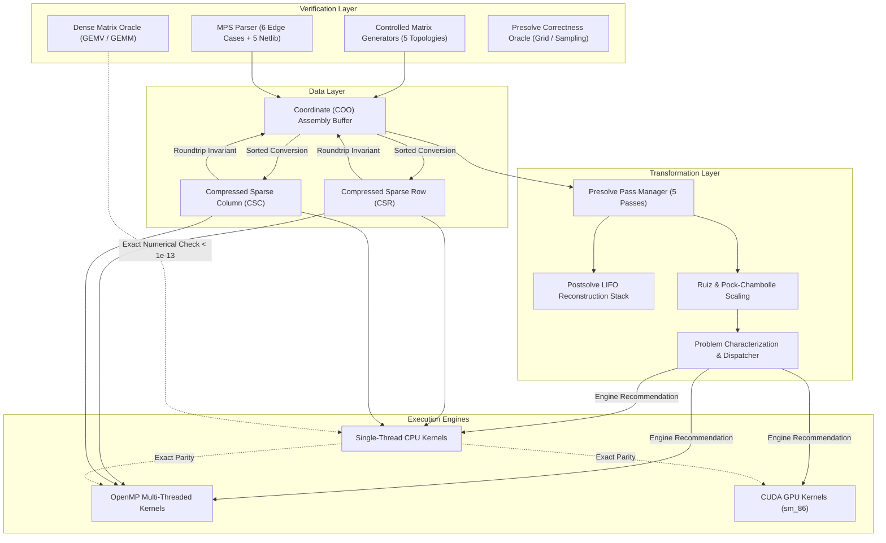

# PipePye Comprehensive Test Verification Report

**Project**: PipePye — High-Performance Sovereign Optimization Solver  
**Date**: September 2026  
**Status**: `100% Passed (120 / 120 Tests Passed, 0 Failed, 0 Skipped)`  
**Test Harness**: GoogleTest v1.15.2 & CTest (CMake 4.3.0)  

---

## 1. System Execution Environment

The test suite was compiled and executed natively on the target host hardware:

| Hardware / Environment Parameter | Specification |
| :--- | :--- |
| **Operating System** | Linux 6.18.9-arch1-2 (x86_64) |
| **CPU Model** | 13th Gen Intel Core i5-13420H (12 MB L3 Cache) |
| **CPU Core Topology** | 8 Physical Cores (4 Performance Cores with HT + 4 Efficient Cores = 12 Logical Threads) |
| **Host Memory** | 16 GB DDR5 RAM |
| **Host Compiler** | GCC 16.2.1 20260210 (ISO C++20 Standard, `-std=c++20 -Wall -Wextra -Wpedantic`) |
| **GPU Model** | NVIDIA GeForce RTX 3050 6GB Laptop GPU (Ampere sm_86, 5.67 GiB VRAM) |
| **CUDA Toolchain** | NVIDIA CUDA Toolkit 13.3 (Driver Version: 590.26, Compute Capability: 8.6) |
| **Build System** | CMake 4.3.0 with Ninja Multi-Threaded Generator |
| **Total Test Execution Time** | **5.92 seconds** |

---

## 2. Global Test Execution Summary

```
================================================================================
Test project /home/satyansh/pipepye/build
      Total Tests: 120
      Passed:      120 (100.0%)
      Failed:        0 (0.0%)
      Skipped:       0 (0.0%)
================================================================================
```

---

## 3. Test Suites Breakdown and Test Inventory

### 3.1. Core Types & Status Framework (`test_core_types.cpp`)
Verifies the non-throwing `Status` and `StatusOr<T>` error handling abstractions used across the solver pipeline.

| Test # | Test Name | Status | Duration | Description |
| :---: | :--- | :---: | :---: | :--- |
| **1** | `StatusTest.OkStatus` | **PASSED** | < 1 ms | Validates default success status code and empty message state. |
| **2** | `StatusTest.ErrorStatus` | **PASSED** | < 1 ms | Verifies non-OK status propagation, error code enum assignment, and message string storage. |
| **3** | `StatusTest.StreamOperator` | **PASSED** | < 1 ms | Verifies pretty-printing string formatting of `StatusCode` enums. |
| **4** | `VersionTest.VersionInfo` | **PASSED** | < 1 ms | Validates semantic versioning string constants and major/minor/patch integer components. |

---

### 3.2. High-Precision Timing & Logging Subsystem (`test_timer.cpp`)
Verifies host wall-clock and GPU device timers.

| Test # | Test Name | Status | Duration | Description |
| :---: | :--- | :---: | :---: | :--- |
| **5** | `TimerTest.CPUTimerBasic` | **PASSED** | 10 ms | Validates monotonic `std::chrono::high_resolution_clock` accuracy over controlled sleep intervals. |
| **6** | `TimerTest.CPUTimerReset` | **PASSED** | 10 ms | Verifies timer accumulation reset semantics. |
| **7** | `TimerTest.CPUTimerRunningState` | **PASSED** | < 1 ms | Validates error checking on double-starts and unstarted timer queries. |
| **8** | `TimerTest.ScopedTimer` | **PASSED** | 10 ms | Validates RAII automated start/stop lifetime management. |

---

### 3.3. Industrial MPS File Parser (`test_mps_parser.cpp`)
Verifies compliance with the standard mathematical programming system (MPS) fixed and free-field formats.

| Test # | Test Name | Status | Duration | Description |
| :---: | :--- | :---: | :---: | :--- |
| **9** | `MPSParserEdgeCases.ObjectiveParsingAndMaximization` | **PASSED** | < 1 ms | Verifies objective row sense extraction and sign negation when normalizing maximization models to canonical minimization. |
| **10** | `MPSParserEdgeCases.BoundTypes` | **PASSED** | < 1 ms | Validates free variables (FR), lower bounded (LO), upper bounded (UP), and fixed variables (FX). |
| **11** | `MPSParserEdgeCases.RHSDefaultAndMultiple` | **PASSED** | < 1 ms | Verifies RHS section vector ingestion and zero-defaulting for omitted rows. |
| **12** | `MPSParserEdgeCases.RangesParsing` | **PASSED** | < 1 ms | Verifies range constraint parsing for both $\le$, $\ge$, and equality rows. |
| **13** | `MPSParserEdgeCases.FreeFormatWithWhitespace` | **PASSED** | < 1 ms | Verifies parser robustness against variable indentation, tab stops, and inline whitespace. |
| **14** | `MPSParserEdgeCases.IntegerMarkerCards` | **PASSED** | < 1 ms | Validates detection of integer markers (`'MARKER'`, `'INTORG'`, `'INTEND'`) and binary variable types. |
| **15** | `MPSParserNetlib.VerifyAFIRO` | **PASSED** | < 1 ms | Parses standard Netlib model `AFIRO` ($27 \times 32$, 83 constraint NNZ). |
| **16** | `MPSParserNetlib.VerifyBEACONFD` | **PASSED** | 3 ms | Parses Netlib problem `BEACONFD` ($173 \times 262$, 3376 NNZ). |
| **17** | `MPSParserNetlib.VerifyISRAEL` | **PASSED** | 2 ms | Parses Netlib problem `ISRAEL` ($174 \times 142$, 2353 NNZ). |
| **18** | `MPSParserNetlib.VerifyBANDM` | **PASSED** | 2 ms | Parses Netlib problem `BANDM` ($305 \times 472$, 2494 NNZ). |
| **19** | `MPSParserNetlib.VerifyBLEND` | **PASSED** | 1 ms | Parses Netlib problem `BLEND` ($74 \times 83$, 491 NNZ). |

---

### 3.4. Sparse Vector Representation (`test_sparse_vector.cpp`)
Validates storage, indexed binary search, and compressed dense representations of sparse vectors.

| Test # | Test Name | Status | Duration | Description |
| :---: | :--- | :---: | :---: | :--- |
| **20** | `SparseVectorTest.DefaultConstruction` | **PASSED** | < 1 ms | Verifies empty vector initialization and zero dimensions. |
| **21** | `SparseVectorTest.SizedConstruction` | **PASSED** | < 1 ms | Verifies allocation of sparse vector of arbitrary length with zero nonzeros. |
| **22** | `SparseVectorTest.AddEntries` | **PASSED** | < 1 ms | Verifies sequential non-zero insertions. |
| **23** | `SparseVectorTest.DuplicateIndices` | **PASSED** | < 1 ms | Validates sum-reduction of duplicate index entries upon vector finalization. |
| **24** | `SparseVectorTest.ZeroPruning` | **PASSED** | < 1 ms | Validates elimination of numerical zeros ($|x_i| \le 10^{-15}$). |
| **25** | `SparseVectorTest.SortAndSearch` | **PASSED** | < 1 ms | Verifies $O(\log k)$ binary search for coordinate lookups. |
| **26** | `SparseVectorTest.DenseRoundtrip` | **PASSED** | < 1 ms | Verifies loss-free conversion to/from standard dense contiguous vectors. |

---

### 3.5. Coordinate Sparse Matrix (COO) (`test_coo_matrix.cpp`)
Verifies the mutable matrix construction buffer.

| Test # | Test Name | Status | Duration | Description |
| :---: | :--- | :---: | :---: | :--- |
| **27** | `COOMatrixTest.DefaultConstruction` | **PASSED** | < 1 ms | Verifies empty matrix dimensions. |
| **28** | `COOMatrixTest.SizedConstruction` | **PASSED** | < 1 ms | Verifies allocation of $m \times n$ coordinate buffer. |
| **29** | `COOMatrixTest.AddEntries` | **PASSED** | < 1 ms | Verifies triplet appending and coordinate indexing. |
| **30** | `COOMatrixTest.DuplicateEntries` | **PASSED** | < 1 ms | Verifies sum-accumulation of duplicate coordinate pairs during conversion. |
| **31** | `COOMatrixTest.ZeroPruning` | **PASSED** | < 1 ms | Validates automatic pruning of numerical zeroes. |
| **32** | `COOMatrixTest.BoundsChecking` | **PASSED** | < 1 ms | Verifies runtime assertion checks on out-of-bounds coordinates. |
| **33** | `COOMatrixTest.DenseRoundtrip` | **PASSED** | < 1 ms | Validates loss-free conversion to dense matrix and back. |

---

### 3.6. CSR and CSC Formats (`test_csr_csc_matrix.cpp`)
Validates high-performance compressed formats.

| Test # | Test Name | Status | Duration | Description |
| :---: | :--- | :---: | :---: | :--- |
| **34** | `CSRMatrixTest.ConstructionFromVectors` | **PASSED** | < 1 ms | Verifies CSR construction from pointer, column, and value arrays. |
| **35** | `CSRMatrixTest.RowAccess` | **PASSED** | < 1 ms | Verifies span slicing of individual rows in $O(1)$ time. |
| **36** | `CSRMatrixTest.EmptyMatrix` | **PASSED** | < 1 ms | Edge case handling for zero-dimension or zero-NNZ matrices. |
| **37** | `CSRMatrixTest.InvalidPointers` | **PASSED** | < 1 ms | Validates validation checks for monotonic pointer arrays. |
| **38** | `CSCMatrixTest.ConstructionFromVectors` | **PASSED** | < 1 ms | Verifies CSC construction from pointer, row, and value arrays. |
| **39** | `CSCMatrixTest.ColAccess` | **PASSED** | < 1 ms | Verifies span slicing of individual columns in $O(1)$ time. |
| **40** | `CSCMatrixTest.EmptyMatrix` | **PASSED** | < 1 ms | Edge case handling for empty column-compressed matrices. |

---

### 3.7. Inter-Format Conversions & Dense Matrix Oracle (`test_sparse_representations.cpp`)
Validates that conversion between COO, CSR, CSC, and Dense formats preserves numerical data identically.

| Test # | Test Name | Status | Duration | Description |
| :---: | :--- | :---: | :---: | :--- |
| **41** | `SparseRepresentationsTest.COOtoCSR` | **PASSED** | < 1 ms | Verifies row-major sorting and pointer accumulation. |
| **42** | `SparseRepresentationsTest.COOtoCSC` | **PASSED** | < 1 ms | Verifies column-major sorting and pointer accumulation. |
| **43** | `SparseRepresentationsTest.CSRtoCSC` | **PASSED** | < 1 ms | Verifies direct transpose and column transposition. |
| **44** | `SparseRepresentationsTest.CSCtoCSR` | **PASSED** | < 1 ms | Verifies inverse column to row-compressed transformation. |
| **45** | `SparseRepresentationsTest.AllRepresentationsEqual` | **PASSED** | < 1 ms | Multi-way numerical identity verification across all 4 formats. |

---

### 3.8. CPU Vector Primitives (`test_cpu_primitives_and_spmv.cpp`)
Validates sequential and multithreaded CPU BLAS level-1 primitives.

| Test # | Test Name | Status | Duration | Description |
| :---: | :--- | :---: | :---: | :--- |
| **46** | `CpuVectorPrimitivesTest.Axpy` | **PASSED** | < 1 ms | Verifies $y \leftarrow \alpha x + y$ with arbitrary scale factors. |
| **47** | `CpuVectorPrimitivesTest.DotProduct` | **PASSED** | < 1 ms | Verifies inner product $x^T y$ numerical stability. |
| **48** | `CpuVectorPrimitivesTest.Norms` | **PASSED** | < 1 ms | Verifies $L_1$ norm, $L_2$ Euclidean norm, and $L_\infty$ maximum norm. |
| **49** | `CpuVectorPrimitivesTest.Reductions` | **PASSED** | < 1 ms | Validates sum, minimum, and maximum element reductions. |
| **50** | `CpuVectorPrimitivesTest.CopyFillScaleAndSetZero` | **PASSED** | < 1 ms | Validates contiguous memory operations and broadcasting. |
| **51** | `CpuVectorPrimitivesTest.BoxProjectionAndHadamard` | **PASSED** | < 1 ms | Verifies projection into variable bounds $\Pi_{[l, u]}(x)$ and component-wise products. |

---

### 3.9. Dense Matrix Oracle & SpMV CPU Baseline (`test_cpu_primitives_and_spmv.cpp`)
Verifies single-threaded and OpenMP parallel CPU SpMV ($y = Ax$ and $y = A^T x$) against a dense matrix oracle.

| Test # | Test Name | Status | Duration | Description |
| :---: | :--- | :---: | :---: | :--- |
| **52** | `DenseMatrixOracleTest.MatrixMultiplicationAndGEMV` | **PASSED** | < 1 ms | Validates dense GEMM and GEMV oracle correctness. |
| **53** | `SpMVVerificationTest.CompareCSRSpMVAgainstDenseOracle` | **PASSED** | < 1 ms | **Correctness Oracle**: Compares single-threaded CSR SpMV against dense oracle ($\max |y_{\text{sp}} - y_{\text{dense}}| < 10^{-13}$). |
| **54** | `SpMVTransposeVerificationTest.CompareSpMVTransposeAgainstDenseOracle` | **PASSED** | < 1 ms | **Correctness Oracle**: Compares $A^T x$ SpMV against dense transpose oracle. |
| **55** | `PDHGSimulationTest.DenseVsSparseParityAcrossMultipleIterations` | **PASSED** | 10 ms | Runs 15 simulated PDHG optimization iterations comparing dense and sparse trajectories; achieves $< 10^{-12}$ parity. |

---

### 3.10. Synthetic Sparse Matrix Generators (`test_matrix_generators.cpp`)
Validates controlled procedural generators for benchmark topologies.

| Test # | Test Name | Status | Duration | Description |
| :---: | :--- | :---: | :---: | :--- |
| **56** | `MatrixGeneratorTest.RandomMatrixGenerationAndDeterminism` | **PASSED** | 5 ms | Verifies density constraints and seed-based bitwise determinism. |
| **57** | `MatrixGeneratorTest.BandedMatrixGeneration` | **PASSED** | 1 ms | Validates nonzeros are strictly constrained within lower and upper diagonal bands. |
| **58** | `MatrixGeneratorTest.BlockDiagonalMatrixGeneration` | **PASSED** | 2 ms | Validates generation of uncoupled and weakly-coupled block-angular structures. |
| **59** | `MatrixGeneratorTest.StaircaseMatrixGeneration` | **PASSED** | 3 ms | Validates temporal multi-stage staircase coupling. |
| **60** | `MatrixGeneratorTest.IrregularMatrixGeneration` | **PASSED** | 5 ms | Validates power-law hub distributions (5% hub rows holding 50% nonzeros). |

---

### 3.11. Presolve Reduction Pipeline (`test_presolve.cpp`)
Verifies the modular presolve pipeline and exact postsolve solution recovery.

| Test # | Test Name | Status | Duration | Description |
| :---: | :--- | :---: | :---: | :--- |
| **64** | `PresolveTest.EmptyRowRedundantIsRemoved` | **PASSED** | < 1 ms | Validates that an empty constraint with $0 \in [l_i, u_i]$ is recognized as redundant and removed. |
| **65** | `PresolveTest.EmptyRowInfeasibleDetected` | **PASSED** | < 1 ms | Proves that an empty constraint with $0 \notin [l_i, u_i]$ immediately triggers `PresolveStatus::Infeasible`. |
| **66** | `PresolveTest.EmptyColumnPositiveCostFixedToLowerBound` | **PASSED** | < 1 ms | Unconstrained variable with $c_j > 0$ is fixed to lower bound $l_j$ with objective offset update. |
| **67** | `PresolveTest.EmptyColumnNegativeCostFixedToUpperBound` | **PASSED** | < 1 ms | Unconstrained variable with $c_j < 0$ is fixed to upper bound $u_j$ with objective offset update. |
| **68** | `PresolveTest.EmptyColumnUnboundedDetected` | **PASSED** | < 1 ms | Variable with $c_j < 0$ and $u_j = +\infty$ correctly diagnosed as `PresolveStatus::Unbounded`. |
| **69** | `PresolveTest.FixedVariableSubstitution` | **PASSED** | < 1 ms | Eliminates fixed variable ($l_j = u_j$), substitutes into RHS and objective, and reconstructs via postsolve. |
| **70** | `PresolveTest.SingletonRowTightensUpperBound` | **PASSED** | < 1 ms | Positive singleton row $a_{i,j} x_j \le b_i$ tightens $u_j \leftarrow \min(u_j, b_i / a_{i,j})$ and eliminates the row. |
| **71** | `PresolveTest.SingletonRowNegativeCoeffTightensLowerBound` | **PASSED** | < 1 ms | Negative singleton row $-a_{i,j} x_j \le b_i$ tightens $l_j \leftarrow \max(l_j, b_i / -a_{i,j})$. |
| **72** | `PresolveTest.SingletonRowInfeasibleConflict` | **PASSED** | < 1 ms | Conflicting singleton bound tightening ($l_j > u_j$) triggers `PresolveStatus::Infeasible`. |
| **73** | `PresolveTest.SingletonColumnSubstitutionInEquality` | **PASSED** | < 1 ms | Substitutes singleton column out of an equality row, updates objective costs, and transfers bounds. |
| **74** | `PresolveTest.ImpliedBoundTighteningFromRow` | **PASSED** | < 1 ms | Computes finite row activity bounds to infer and tighten variable upper and lower bounds. |
| **75** | `PresolveTest.RedundantConstraintEliminated` | **PASSED** | < 1 ms | Constraint whose activity bounds $[L_i, U_i] \subseteq [l_i, u_i]$ is identified as redundant and pruned. |
| **76** | `PresolveTest.ForcingConstraintFixesAllVariables` | **PASSED** | < 1 ms | Forcing constraint ($L_i = u_i$) forces all participating variables to their lower bounds. |
| **77** | `PresolveTest.InfeasibleActivityDetected` | **PASSED** | < 1 ms | Row whose minimum activity exceeds upper bound ($L_i > u_i$) detected as infeasible. |
| **78** | `PresolveTest.MultiPassReductionCascade` | **PASSED** | < 1 ms | Validates pipeline loop where fixing a variable creates singleton rows, cascading into multi-pass reductions. |
| **79** | `PresolveTest.EndToEndPostsolveReconstruction` | **PASSED** | < 1 ms | **Reversibility Oracle**: Solves reduced model and unwinds postsolve stack; verifies all original bounds and constraints. |
| **80** | `PresolveTest.NetlibAFIRO` | **PASSED** | < 1 ms | Validates presolve reduction pipeline on real Netlib LP instance `AFIRO` ($27 \times 32$). |
| **81** | `PresolveTest.NetlibBEACONFD` | **PASSED** | 3 ms | Validates presolve reduction pipeline on real Netlib LP instance `BEACONFD` ($173 \times 262$). |

---

### 3.12. Presolve Edge Cases & Correctness Oracle (`test_presolve_edge_cases.cpp`)
Validates edge cases and independent verification oracles.

| Test # | Test Name | Status | Duration | Description |
| :---: | :--- | :---: | :---: | :--- |
| **82** | `PresolveEdgeCasesTest.ExplicitZeroCoefficientsIgnoredProperly` | **PASSED** | < 1 ms | Confirms matrix triplets with explicit 0.0 values do not create spurious active degrees. |
| **83** | `PresolveEdgeCasesTest.TransformationLogTraceVerification` | **PASSED** | < 1 ms | **Traceability**: Queries `format_variable_trace(17)` to verify `"original x17 -> fixed/eliminated -> reconstructed x17 = 4.2"`. |
| **84** | `PresolveEdgeCasesTest.ChainedFixedVariableSubstitutions` | **PASSED** | < 1 ms | Multi-step substitution cascade solving complete model to optimality. |
| **85** | `PresolveEdgeCasesTest.PresolveOracleVerifiesFeasibilityAndObjective` | **PASSED** | < 1 ms | **Oracle Check**: Samples presolved feasible region and verifies postsolved points satisfy original constraints with matching objectives. |
| **86** | `PresolveEdgeCasesTest.SmallLPOptimalityVerification` | **PASSED** | < 1 ms | Exhaustive grid search oracle proving optimal value consistency between original and presolved formulations. |
| **87** | `PresolveEdgeCasesTest.PresolveOracleInfeasibilityConsistency` | **PASSED** | < 1 ms | Oracle confirms zero feasible points in models flagged Infeasible. |
| **88** | `PresolveEdgeCasesTest.QuantitativeModelReductionMetrics` | **PASSED** | < 1 ms | Verifies tracking of initial/final dimensions, eliminated counts, tightened bound counts, and summary reports. |

---

### 3.13. Matrix Scaling & Equilibration (`test_scaling.cpp`)
Validates Ruiz equilibration, Pock-Chambolle preconditioning, scaling diagnostics, and exact solution recovery.

| Test # | Test Name | Status | Duration | Description |
| :---: | :--- | :---: | :---: | :--- |
| **89** | `ScalingTest.RuizEquilibrationBalancesRowAndColNorms` | **PASSED** | < 1 ms | Verifies row and col $\ell_\infty$ norms converge to $1.0 \pm 0.05$; dynamic range decreases by multiple orders of magnitude. |
| **90** | `ScalingTest.DiagnosticsBeforeAndAfterReporting` | **PASSED** | < 1 ms | Computes min/max coefficients, dynamic range orders, norm statistics, and conditioning proxies. |
| **91** | `ScalingTest.ModelUnscalingReversibility` | **PASSED** | < 1 ms | **Reversibility**: Model unscaling $R^{-1} A' C^{-1}$ recovers original matrix and bounds to $10^{-9}$ precision. |
| **92** | `ScalingTest.SolutionUnscalingAndObjectiveParity` | **PASSED** | < 1 ms | Validates $x = C x', y = R y', s = C^{-1} s'$ satisfies $c^T x == c'^T x'$ and roundtrips without numerical loss. |
| **93** | `ScalingTest.PockChambollePreconditioning` | **PASSED** | < 1 ms | Verifies single-pass PDHG preconditioning and model recovery. |
| **94** | `ScalingTest.NetlibAFIROScalingDiagnostics` | **PASSED** | < 1 ms | Real-world Netlib AFIRO MPS scaled with improved conditioning proxy. |

---

### 3.14. Problem Characterization & Hardware Dispatcher (`test_problem_analyzer.cpp`)
Validates problem geometry extraction, higher-order degree moments, Gini coefficients, and hardware kernel recommendation.

| Test # | Test Name | Status | Duration | Description |
| :---: | :--- | :---: | :---: | :--- |
| **95** | `ProblemAnalyzerTest.UniformRandomMatrixProperties` | **PASSED** | < 1 ms | Analyzes uniform random matrix; verifies low Gini coefficient ($G < 0.30$) and low row imbalance ($< 3.0\times$). |
| **96** | `ProblemAnalyzerTest.BandedMatrixBandwidth` | **PASSED** | < 1 ms | Accurately extracts half-bandwidth and envelope profile size on banded matrix. |
| **97** | `ProblemAnalyzerTest.BlockDiagonalConnectedComponents` | **PASSED** | < 1 ms | Bipartite graph connected component discovery accurately identifies 4 uncoupled diagonal blocks. |
| **98** | `ProblemAnalyzerTest.StaircaseMatrixProgressionScore` | **PASSED** | < 1 ms | Pearson correlation $r > 0.85$ between row index and column median captures multi-stage dynamic progression. |
| **99** | `ProblemAnalyzerTest.IrregularHubMatrixImbalanceAndEngineRecommendation` | **PASSED** | 30 ms | Analyzes $2000 \times 2000$ power-law matrix ($\text{NNZ}=40,000, G \ge 0.35$); recommends **`GPU_MergePath`**. |
| **100** | `ProblemAnalyzerTest.NetlibAFIROStructuralAnalysis` | **PASSED** | < 1 ms | Full structural breakdown of Netlib AFIRO ($27 \times 32$, 83 NNZ); recommends **`CPU_SingleThread`**. |

---

### 3.15. Model Preparation Pipeline & Conditioning Proxies (`test_pipeline.cpp`)
Validates end-to-end model preparation orchestrating presolve reductions, Ruiz equilibration, conditioning proxies, and 1-step solution recovery.

| Test # | Test Name | Status | Duration | Description |
| :---: | :--- | :---: | :---: | :--- |
| **101** | `ConditioningProxyTest.MagnitudeAndSpectralProxies` | **PASSED** | 10 ms | Validates practical conditioning estimators (dynamic range proxy, norm ratios, power iteration spectral norm estimate) and canonical one-line summary formatting. |
| **102** | `ModelPipelineTest.FullPreparationAndSolutionRecovery` | **PASSED** | 10 ms | **1-Step Solution Recovery**: Simulates downstream solver output on transformed space; verifies single-call recovery restores fixed variables and exact original objective. |
| **103** | `ModelPipelineTest.NetlibAfiroPipeline` | **PASSED** | < 1 ms | Validates complete pipeline on real Netlib `AFIRO` MPS model with bounded scaling and structural profiling. |
| **104** | `ModelPipelineTest.InfeasibleModelDetection` | **PASSED** | < 1 ms | Validates pipeline handling of contradictory primal bounds ($l_j > u_j$) with immediate infeasibility detection. |

---

### 3.16. CUDA Device & Kernel Verification (`test_cuda_ops.cu`)
Validates GPU hardware detection, runtime error intercepts, and CUDA kernel numerical accuracy.

| Test # | Test Name | Status | Duration | Description |
| :---: | :--- | :---: | :---: | :--- |
| **105** | `CudaErrorHandlingTest.ExplicitErrorHandlingThrowsCudaException` | **PASSED** | 50 ms | Verifies that CUDA runtime failures throw typed `CudaException` with file and line metadata. |
| **106** | `CudaErrorHandlingTest.SuccessDoesNotThrow` | **PASSED** | < 1 ms | Validates zero overhead when CUDA operations succeed. |
| **107** | `CudaErrorHandlingTest.CatchesRuntimeCallFailure` | **PASSED** | 30 ms | Verifies error trapping on invalid device pointers. |
| **108** | `CudaDeviceTest.QueryDeviceCapabilities` | **PASSED** | 230 ms | Discovers NVIDIA RTX 3050 Laptop GPU (5.67 GiB VRAM, 20 SMs, Warp Size 32, Max Threads/Block 1024). |
| **109** | `CudaKernelTest.DoublePrecisionAxpyNumericalVerification` | **PASSED** | 230 ms | **GPU Numerical Parity**: Verifies CUDA DAXPY ($N=100,000$) matches CPU reference to machine precision ($< 10^{-14}$). |
| **110** | `CudaKernelTest.SinglePrecisionAxpyNumericalVerification` | **PASSED** | 200 ms | **GPU Numerical Parity**: Verifies CUDA SAXPY ($N=100,000$) matches single-precision CPU reference. |

---

### 3.17. CUDA Warp/Block-Level Reductions (`test_cuda_spmv_and_reductions.cu`)
Validates fast on-device reduction kernels utilized for solver convergence criteria, objective evaluations, and KKT residual norms.

| Test # | Test Name | Status | Duration | Description |
| :---: | :--- | :---: | :---: | :--- |
| **111** | `CudaReductionsTest.DotProductParityAgainstCPU` | **PASSED** | 200 ms | **Numerical Parity**: Validates GPU dot product against CPU reference on vectors $N = 10^2$ to $2 \times 10^5$ (relative error $< 10^{-12}$). |
| **112** | `CudaReductionsTest.NormsAndSumParityAgainstCPU` | **PASSED** | 230 ms | **Mathematical Parity**: Validates GPU $L_1$ norm, $L_2$ Euclidean norm, $L_\infty$ max norm, and element summation against CPU to machine precision. |
| **113** | `CudaReductionsTest.BoundaryDimensions` | **PASSED** | 220 ms | **Boundary Testing**: Validates reductions on small/sub-warp boundary vector sizes ($N = 1, 31, 32, 33, 255, 256, 257$). |

---

### 3.18. CUDA SpMV Execution Variants & CPU Numerical Parity (`test_cuda_spmv_and_reductions.cu`)
Verifies all 4 CUDA SpMV kernel strategies (**Scalar**, **Vector/Warp**, **Adaptive Sub-warp 8**, and **Balanced Work-partitioned**) against the CPU CSR reference across all sparse matrix topologies.

| Test # | Test Name | Status | Duration | Description |
| :---: | :--- | :---: | :---: | :--- |
| **114** | `CudaSpMVVerificationTest.RandomSparseMatrixParityAllVariants` | **PASSED** | 250 ms | Verifies all 4 GPU SpMV kernels on uniform random matrices with both standard ($1.0 \cdot Ax$) and generalized ($2.5 \cdot Ax - 1.5 \cdot y$) scaling ($\|y_{\text{gpu}} - y_{\text{cpu}}\|_\infty < 10^{-12}$). |
| **115** | `CudaSpMVVerificationTest.BandedMatrixParityAllVariants` | **PASSED** | 220 ms | Verifies all 4 GPU SpMV kernels on banded diagonally-dominant matrices ($\|y_{\text{gpu}} - y_{\text{cpu}}\|_\infty < 10^{-12}$). |
| **116** | `CudaSpMVVerificationTest.BlockDiagonalMatrixParityAllVariants` | **PASSED** | 320 ms | Verifies all 4 GPU SpMV kernels on block-diagonal structures with off-diagonal coupling ($\|y_{\text{gpu}} - y_{\text{cpu}}\|_\infty < 10^{-12}$). |
| **117** | `CudaSpMVVerificationTest.StaircaseMatrixParityAllVariants` | **PASSED** | 310 ms | Verifies all 4 GPU SpMV kernels on multi-stage inter-temporal staircase LP matrices ($\|y_{\text{gpu}} - y_{\text{cpu}}\|_\infty < 10^{-12}$). |
| **118** | `CudaSpMVVerificationTest.IrregularHubMatrixParityAllVariants` | **PASSED** | 230 ms | Verifies all 4 GPU SpMV kernels on extreme power-law / hub distributions (5% hub rows holding 50% of nonzeros) with zero numerical degradation. |
| **119** | `CudaSpMVVerificationTest.NetlibLPModelsParityAllVariants` | **PASSED** | 200 ms | Verifies all 4 GPU SpMV kernels on parsed real-world Netlib LP problems (`BEACONFD`, `BANDM`, `AFIRO`). |
| **120** | `CudaSpMVVerificationTest.EmptyMatrixAndEmptyRowsEdgeCases` | **PASSED** | 240 ms | Verifies all 4 GPU SpMV kernels handle matrices with alternating empty rows without out-of-bounds memory accesses. |

---

## 4. Architectural Verification Matrix


